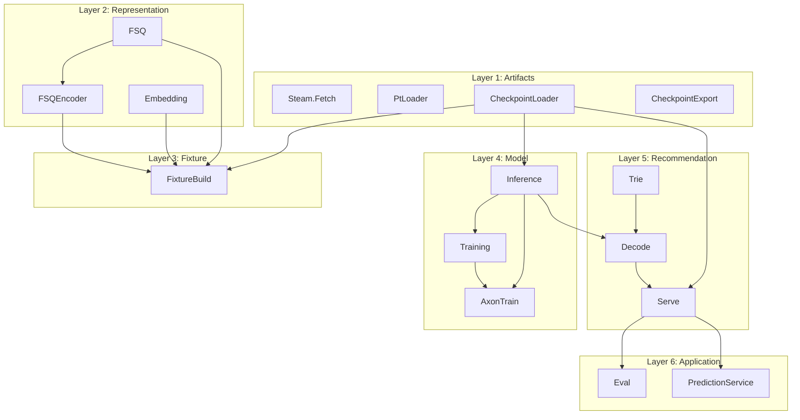

# Layers: smaller, testable systems

## Current state

Modules today form a dependency DAG but are flat under `RecGPT.*`. Tests already stub at boundaries (e.g. `build_stub_state` for Serve, stub state for Eval). There is no single document that defines layers or a testing strategy per layer.

**Dependency rule:** A layer only depends on layers below it. No circular deps. Each layer can be tested by stubbing the layer(s) below (or using real lower layers and only stubbing I/O).

---

## Proposed layers (bottom to top)

| Layer                 | Modules                                                           | Responsibility                                                                                                | Test strategy                                                                                                                                                                                                                                                     |
| --------------------- | ----------------------------------------------------------------- | ------------------------------------------------------------------------------------------------------------- | ----------------------------------------------------------------------------------------------------------------------------------------------------------------------------------------------------------------------------------------------------------------- |
| **1. Artifacts**      | `Steam.Fetch`, `PtLoader`, `CheckpointLoader`, `CheckpointExport` | Read/write files and network: Steam JSON, `.pt`, export dir (manifest + .npy). No RecGPT business logic.      | Unit tests with temp files or fixtures; no other RecGPT modules.                                                                                                                                                                                                  |
| **2. Representation** | `FSQ`, `FSQEncoder`, `Embedding`                                  | Text → vectors (Bumblebee) → token IDs (FSQ). No model, no checkpoint beyond FSQ params.                      | Unit tests with stub or real FSQ params; Embedding tests may need Bumblebee.                                                                                                                                                                                      |
| **3. Fixture**        | `FixtureBuild`                                                    | Items JSON + checkpoint (for FSQ params) → fixture.json (num_items, token_id_list).                           | Unit tests: stub Embedding/CheckpointLoader or use real files ([fixture_build_test.exs](test/recgpt/fixture_build_test.exs)).                                                                                                                                     |
| **4. Model**          | `Inference`, `Training`, `AxonTrain`                              | Forward pass, loss, training loop. Params from checkpoint.                                                    | Unit tests: stub params for Inference; Training uses FSQ; AxonTrain uses Inference + Training ([inference_test.exs](test/recgpt/inference_test.exs), [training_test.exs](test/recgpt/training_test.exs), [axon_train_test.exs](test/recgpt/axon_train_test.exs)). |
| **5. Recommendation** | `Trie`, `Decode`, `Serve`                                         | Trie from token_id_list; beam search (Decode) with get_logits from Inference; Serve = load_state + recommend. | Unit tests: Trie/Decode with stub get_logits; Serve with stub state or full stack ([trie_test.exs](test/recgpt/trie_test.exs), [decode_test.exs](test/recgpt/decode_test.exs), [serve_test.exs](test/recgpt/serve_test.exs)).                                     |
| **6. Application**    | `Eval`, `Recgpt.V1.PredictionService.Server`, `GRPCEndpoint`      | Eval = metrics over test cases using Serve.recommend; gRPC = Predict RPC delegating to Serve.recommend.       | Unit tests: stub Serve state for Eval and PredictionService ([eval_test.exs](test/recgpt/eval_test.exs), [prediction_service_test.exs](test/recgpt/v1/prediction_service_test.exs)). Integration: real stack.                                                     |

---

## Implementation options

### Option A: Document only (minimal)

- Add a **Layers** section to [docs/03_recgpt_library.md](docs/03_recgpt_library.md) (or a new doc) that:
  - Lists the six layers and their modules.
  - States the rule: “A layer only depends on layers below.”
  - For each layer: purpose, public “API” (main functions), and how to test (what to stub, existing test files).
- No code or directory changes. Improves clarity and gives a testing checklist.

### Option B: Document + one behaviour at Layer 5/6 boundary

- Do Option A.
- Introduce a **behaviour** for “recommendation” so Layer 6 depends on an interface, not `RecGPT.Serve` by name:
  - e.g. `@callback recommend(state, context_item_ids, max_results) :: {:ok, [item_id]} | {:error, term}`.
  - `Serve` implements it; `Eval` and `PredictionService.Server` call the behaviour (or a small wrapper that resolves the implementation from config/application env).
- **Benefit:** Eval and gRPC tests can inject a mock that returns fixed recommendations without building Serve state. Same “recommend” contract for any future transport (e.g. another API).

### Option C: Document + optional directory layout

- Do Option A (and optionally B).
- Group code by layer under subdirs, e.g.:
  - `lib/recgpt/artifacts/` (steam, pt_loader, checkpoint_loader, checkpoint_export)
  - `lib/recgpt/representation/` (fsq, fsq_encoder, embedding)
  - `lib/recgpt/fixture/` (fixture_build)
  - `lib/recgpt/model/` (inference, training, axon_train)
  - `lib/recgpt/recommendation/` (trie, decode, serve)
  - `lib/recgpt/application/` or keep Eval/gRPC at top level
- Module names could stay `RecGPT.Serve` etc. (no namespace change) by moving files only; or become `RecGPT.Artifacts.PtLoader` etc. Namespace change is a larger refactor (all references and docs).

Recommendation: **Option A** as the default (document layers and test strategy). Add **Option B** if you want a clear, mockable contract for “recommend” and future transports. **Option C** only if you want discoverability by folder; namespace renames are optional and higher cost.

---

## Concrete steps (Option A)

1. **Respect docs layout:** Docs are ordered API/user-facing first (lowest numbers). Layers are contributor/architecture-facing, so the new doc gets a **higher number**, e.g. `**docs/13_layers_and_testing.md`** (after 12_architecture_references).
2. **Add the Layers doc** with:
  - Diagram (as above) and table of layers with modules, responsibility, test strategy.
  - One short subsection per layer: “What it does”, “Public surface”, “How to test” (and pointer to existing `*_test.exs`).
3. **Update [docs/README.md](docs/README.md):** Add row 13 to the Sub-proposals table (e.g. “Understand layer boundaries and test strategy”) and, if desired, a Quick reference row (e.g. “Understand layers and testing” → 13).
4. **Update [docs/03_recgpt_library.md](docs/03_recgpt_library.md):** Reference the layers doc (e.g. “Layer boundaries and test strategy: [13_layers_and_testing.md](13_layers_and_testing.md)”) and optionally map module areas to layer numbers (e.g. “Core: FSQ and embeddings” → “Layer 2: Representation”).
5. **No code or test changes**; existing tests already align with the layer boundaries (stub state for Serve, Eval, PredictionService).

---

## If you choose Option B (behaviour)

1. Define a behaviour module, e.g. `RecGPT.Recommendation` (or `RecGPT.Application.RecommendationEngine`), with `@callback recommend(state, context_item_ids, max_results)`.
2. Implement it in `RecGPT.Serve` with `@behaviour RecGPT.Recommendation`.
3. In `Eval` and `PredictionService.Server`, call the behaviour (or a function that dispatches to the implementation from application env) instead of `RecGPT.Serve.recommend` directly. Default implementation remains `Serve`.
4. In tests, Eval and PredictionService can set a stub implementation in the application env (or pass a stub state that is handled by a test-only implementation).

This keeps the current behavior the same while making the “recommend” boundary explicit and mockable.