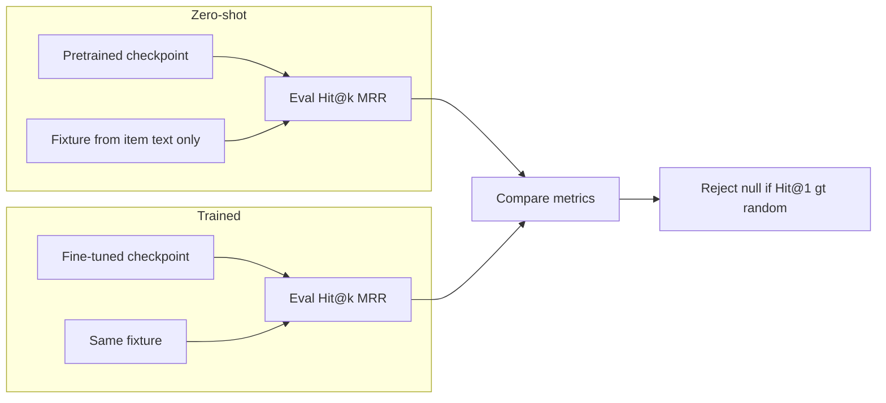

# Evaluation and testing: zero-shot vs trained, null hypothesis

How to evaluate RecGPT (zero-shot and trained), ensure eval uses **held-out data only**, and reject the null hypothesis that the model has no predictive signal.

See also: [00 RecGPT library](00_recgpt_library.md), [02 Checkpoint layout](02_recgpt_checkpoint_layout.md).

---

## 1. Zero-shot vs trained


| Mode          | Checkpoint                                                                        | Fixture                                                       | Training on catalog?               |
| ------------- | --------------------------------------------------------------------------------- | ------------------------------------------------------------- | ---------------------------------- |
| **Zero-shot** | Pretrained (e.g. hkuds/RecGPT_model export)                                       | Built from item text only (Embedding → FSQ → `token_id_list`) | No gradient updates.               |
| **Trained**   | Fine-tuned on this catalog (e.g. Python `pre_train.py` or future Elixir training) | Same fixture, same catalog                                    | Yes; only checkpoint path differs. |


**Zero-shot:** Load pretrained checkpoint + fixture (from item text only). No training step. See [00_recgpt_library.md](00_recgpt_library.md) “Zero-shot mode” for the full flow.

**Trained:** Same catalog and **same held-out test set**; checkpoint is the one fine-tuned on the **train split** of that catalog. Fixture and `test_sequences.json` unchanged.

**How to compare:** Run `mix recgpt.eval` twice: once with pretrained ckpt (zero-shot), once with fine-tuned ckpt (trained). Compare Hit@1, Hit@5, Hit@10, MRR.

---

## 2. Null hypothesis and rejection criterion

- **Null (H0):** “The model has no predictive signal” — performance equals random: Hit@1 ≈ 1/N, MRR ≈ 1/N (N = catalog size).
- **Reject H0** if **Hit@1 > random_hit_at_1** (where `random_hit_at_1 = 1/N`). Optionally also require **MRR > 1/N**.
- The eval task and `RecGPT.Eval.evaluate/3` report `random_hit_at_1`; the mix task prints “Reject null (Hit@1 > random): yes/no”. Use this to confirm the model beats the random baseline.

---

## 3. Train / eval data split (held-out eval)

**Requirement:** Eval must run on **untrained data only**. The dataset must be split so that:

- **Training** (if any) uses one part of the data (e.g. train sequences, or all-but-last per session).
- **Eval** uses a **held-out** part that was **never** used for training.

**Standard approach:** When preparing a dataset (e.g. UCI Clickstream via test-only `RecGPT.Clickstream.Fetch.run()`, or any FOSS prep):

- **Train data:** Full sessions for training, or sequences with last item removed (context only). Training uses only this.
- **Test data:** e.g. last-item-out per session → one test case per session: `context` = all but last click, `next_item` = last click. Those last-item labels are never used as input during training, so eval is on unseen next-item targets.

**In this repo:** `test_sequences.json` must be a held-out set (no overlap with data used to train the model). For UCI Clickstream (test-only: `test/support/recgpt/clickstream/`), `RecGPT.Clickstream.Fetch.write_eval_artifacts/2` builds test cases from last-item-out per session; training would use the same DB but only context sequences, not the held-out next items.

---

## 4. Test set and commands

**Standard test set:** FOSS dataset with sequential data + item text. Example: UCI Clickstream (test-only) — from test environment run `RecGPT.Clickstream.Fetch.run()` to get `data/clickstream/items.json` and `test_sequences.json`. Build the fixture from items (Embedding + FSQ), then run eval. Ensure `test_sequences.json` is held-out (see §3).

**Commands:**

- **Zero-shot:**  
`mix recgpt.eval --fixture <path> --ckpt <pretrained_export> --test <test_sequences.json>`
- **Trained:**  
Same, with `--ckpt <finetuned_export>`. Training must use only the train split; eval uses `test_sequences.json`.

**Paths:** Defaults and overrides: `--fixture`, `--ckpt`, `--test`; env: `RECGPT_FIXTURE`, `RECGPT_CKPT_EXPORT`. Default paths: `data/clickstream/fixture.json`, `data/clickstream/test_sequences.json` (see mix task).

---

## 5. Diagram




---

## 6. Test

**Automated eval test:** `test/recgpt/eval_test.exs` loads fixture + checkpoint + `test_sequences.json`, runs `RecGPT.Eval.evaluate/3`, and asserts **reject null** (Hit@1 > random_hit_at_1). Requires fixture, checkpoint export dir, and test file; skipped when missing (integration/eval tags).

**Run:**

```bash
mix test test/recgpt/eval_test.exs --include eval --include integration
```

**Zero-shot vs trained in CI:** Run the same test with `RECGPT_CKPT_EXPORT` pointing to the pretrained export (zero-shot). For trained, run again with `RECGPT_CKPT_EXPORT` pointing to the fine-tuned export.