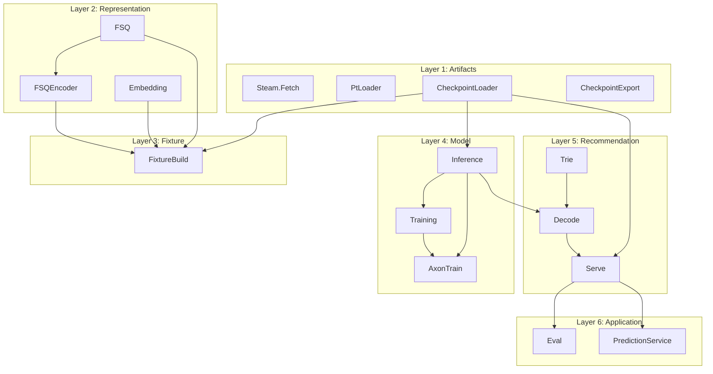

# Proposal: Layers and testing

Sub-proposal of the [documentation index](README.md). Define the codebase as a stack of layers (data, representation, model, recommendation, application), document boundaries and test strategy so each layer is a smaller, testable system.

---

## Problem or limitation

Modules today form a dependency DAG but are flat under `RecGPT.*`. Tests already stub at boundaries (e.g. `build_stub_state` for Serve, stub state for Eval). There is no single document that defines layers or a testing strategy per layer.

---

## Proposed improvement

Define **six layers** (bottom to top): Artifacts, Representation, Fixture, Model, Recommendation, Application. Document for each: modules, responsibility, public surface, and how to test (what to stub, existing test files). **Dependency rule:** A layer only depends on layers below it. No circular deps. Each layer can be tested by stubbing the layer(s) below (or using real lower layers and only stubbing I/O).

---

## Layer diagram

**Dependency rule:** A layer only depends on layers below it. No circular deps. Each layer can be tested by stubbing the layer(s) below (or using real lower layers and only stubbing I/O).

---

## Layers (bottom to top)

| Layer | Modules | Responsibility | Test strategy |
| ----- | ------- | --------------- | ------------- |
| **1. Artifacts** | `Steam.Fetch`, `PtLoader`, `CheckpointLoader`, `CheckpointExport` | Read/write files and network: Steam JSON, `.pt`, export dir (manifest + .npy). No RecGPT business logic. | Unit tests with temp files or fixtures; no other RecGPT modules. |
| **2. Representation** | `FSQ`, `FSQEncoder`, `Embedding` | Text to vectors (Bumblebee) to token IDs (FSQ). No model, no checkpoint beyond FSQ params. | Unit tests with stub or real FSQ params; Embedding tests may need Bumblebee. |
| **3. Fixture** | `FixtureBuild` | Items JSON + checkpoint (for FSQ params) to fixture.json (num_items, token_id_list). | Unit tests: stub Embedding/CheckpointLoader or use real files. |
| **4. Model** | `Inference`, `Training`, `AxonTrain` | Forward pass, loss, training loop. Params from checkpoint. | Unit tests: stub params for Inference; Training uses FSQ; AxonTrain uses Inference + Training. |
| **5. Recommendation** | `Trie`, `Decode`, `Serve` | Trie from token_id_list; beam search (Decode) with get_logits from Inference; Serve = load_state + recommend. | Unit tests: Trie/Decode with stub get_logits; Serve with stub state or full stack. |
| **6. Application** | `Eval`, `Recgpt.V1.PredictionService.Server`, `GRPCEndpoint` | Eval = metrics over test cases using Serve.recommend; gRPC = Predict RPC delegating to Serve.recommend. | Unit tests: stub Serve state for Eval and PredictionService. Integration: real stack. |

---

## Layer 1: Artifacts

**What it does:** Read and write external artifacts: HuggingFace/Steam JSON, PyTorch `.pt` (zip), and the export directory (manifest.json + .npy). No RecGPT-specific logic beyond file layout.

**Public surface:** `Steam.Fetch.run/1`, `RecGPT.PtLoader`, `RecGPT.CheckpointLoader.load_from_export/1`, `RecGPT.CheckpointExport.write_export/2`.

**How to test:** Unit tests with temporary directories and fixture files; no dependency on other RecGPT layers.

---

## Layer 2: Representation

**What it does:** Turn item text into token IDs. Embedding (Bumblebee, MPNet) produces 768-d vectors; FSQ quantizes to 4 token IDs per item. No model weights beyond FSQ params.

**Public surface:** `RecGPT.Embedding.encode_item_text_dict/1`, `RecGPT.FSQ.load_params/1`, `RecGPT.FSQ.encode/2`, `RecGPT.FSQEncoder.encode_embeddings_to_token_id_list/3`.

**How to test:** Unit tests with stub or real FSQ params; Embedding tests may require Bumblebee.

---

## Layer 3: Fixture

**What it does:** Build `fixture.json` (num_items, token_id_list) from items JSON and checkpoint (for FSQ params). Depends on Layer 1 (CheckpointLoader) and Layer 2 (Embedding, FSQEncoder).

**Public surface:** `RecGPT.FixtureBuild.build/2`, `RecGPT.FixtureBuild.write_fixture/2`.

**How to test:** Stub Embedding/CheckpointLoader or use real fixture files; see fixture_build_test.exs.

---

## Layer 4: Model

**What it does:** Forward pass (Inference), loss (Training), and training loop (AxonTrain). Params come from CheckpointLoader. Same forward/loss used for training and inference.

**Public surface:** `RecGPT.Inference.forward/4`, `RecGPT.Inference.forward_full_sequence/4`, `RecGPT.Training.build_train_batch/4`, `RecGPT.Training.loss_shifted_ce/2`, `RecGPT.AxonTrain.stream_batches/4`, `RecGPT.AxonTrain.run/3`.

**How to test:** inference_test.exs, training_test.exs, axon_train_test.exs. Stub checkpoint params for Inference.

---

## Layer 5: Recommendation

**What it does:** Trie from token_id_list; Decode runs beam search using a logits function (from Inference); Serve loads fixture + checkpoint, builds trie and get_logits, and exposes `recommend/3`.

**Public surface:** `RecGPT.Trie.build/1`, `RecGPT.Decode.beam_search_top_k/4`, `RecGPT.Serve.load_state/3`, `RecGPT.Serve.recommend/3`.

**How to test:** trie_test.exs, decode_test.exs, serve_test.exs. Stub get_logits for Trie/Decode; Serve tests can use stub state or full stack.

---

## Layer 6: Application

**What it does:** Eval loads test cases and calls Serve.recommend to compute Hit@k, MRR, etc. PredictionService.Server handles gRPC Predict and delegates to Serve.recommend. GRPCEndpoint wires the server.

**Public surface:** `RecGPT.Eval.evaluate/3`, `RecGPT.Eval.load_test_cases/1`, `Recgpt.V1.PredictionService.Server` (gRPC), `RecGPT.GRPCEndpoint`.

**How to test:** eval_test.exs, prediction_service_test.exs. Stub Serve state for unit tests; integration tests use real stack.

---

## See also

- [03 RecGPT library](03_recgpt_library.md) — Module reference (maps areas to layers).
- [02 Pipeline reference](02_pipeline_reference.md) — Commands and artifact layout.
- [05 Evaluation and testing](05_evaluation_and_testing.md) — Eval metrics and null hypothesis.
