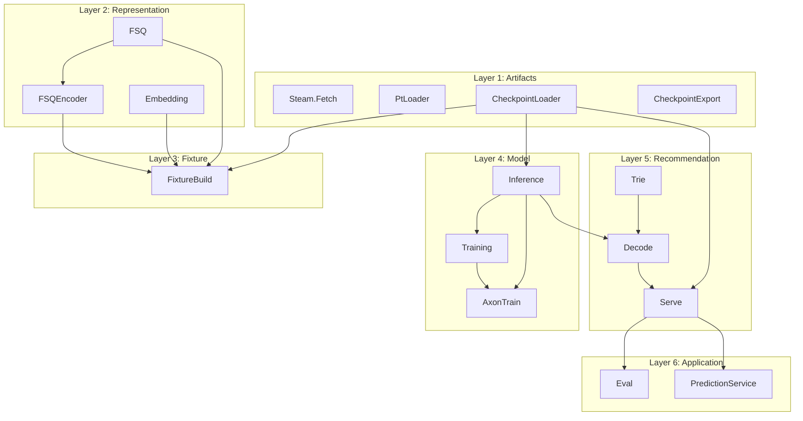

# Layers overview

Sub-proposal of the [documentation index](README.md). Layer diagram and summary table. Per-layer detail: [16 Layers detail](16_layers_detail.md).

---

## Problem or limitation

Modules today form a dependency DAG but are flat under `RecGPT.*`. Tests already stub at boundaries (e.g. `build_stub_state` for Serve, stub state for Eval). There is no single document that defines layers or a testing strategy per layer.

---

## Proposed improvement

Define **six layers** (bottom to top): Artifacts, Representation, Fixture, Model, Recommendation, Application. Document for each: modules, responsibility, public surface, and how to test (what to stub, existing test files). **Dependency rule:** A layer only depends on layers below it. No circular deps. Each layer can be tested by stubbing the layer(s) below (or using real lower layers and only stubbing I/O).

---

## Layer diagram

**Dependency rule:** A layer only depends on layers below it. No circular deps. Each layer can be tested by stubbing the layer(s) below (or using real lower layers and only stubbing I/O).

---

## Layers (bottom to top)

| Layer | Modules | Responsibility | Test strategy |
| ----- | ------- | --------------- | ------------- |
| **1. Artifacts** | `Steam.Fetch`, `PtLoader`, `CheckpointLoader`, `CheckpointExport` | Read/write files and network: Steam JSON, `.pt`, export dir (manifest + .npy). No RecGPT business logic. | Unit tests with temp files or fixtures; no other RecGPT modules. |
| **2. Representation** | `FSQ`, `FSQEncoder`, `Embedding` | Text to vectors (Bumblebee) to token IDs (FSQ). No model, no checkpoint beyond FSQ params. | Unit tests with stub or real FSQ params; Embedding tests may need Bumblebee. |
| **3. Fixture** | `FixtureBuild` | Items JSON + checkpoint (for FSQ params) to fixture.json (num_items, token_id_list). | Unit tests: stub Embedding/CheckpointLoader or use real files. |
| **4. Model** | `Inference`, `Training`, `AxonTrain` | Forward pass, loss, training loop. Params from checkpoint. | Unit tests: stub params for Inference; Training uses FSQ; AxonTrain uses Inference + Training. |
| **5. Recommendation** | `Trie`, `Decode`, `Serve` | Trie from token_id_list; beam search (Decode) with get_logits from Inference; Serve = load_state + recommend. | Unit tests: Trie/Decode with stub get_logits; Serve with stub state or full stack. |
| **6. Application** | `Eval`, `Recgpt.V1.PredictionService.Server`, `GRPCEndpoint` | Eval = metrics over test cases using Serve.recommend; gRPC = Predict RPC delegating to Serve.recommend. | Unit tests: stub Serve state for Eval and PredictionService. Integration: real stack. |

---

---

## See also

- [16 Layers detail](16_layers_detail.md) - Per-layer sections.
- [04 RecGPT library](04_recgpt_library.md) - Module reference.
