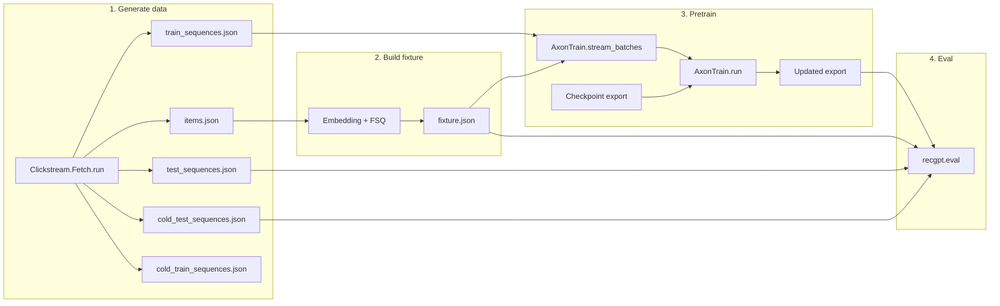

# RecGPT documentation

Documentation for the RecGPT Elixir library: modules, pipeline, evaluation, and data formats.

---

## Pipeline overview

Order: 1 → 2 → 3 → 4. See [08 Pipeline reference](08_pipeline_reference.md) for commands and options.

---

## Start here

- **[../README.md](../README.md)** — Project overview, quick start, pipeline summary, mix tasks, tests.
- **[00_recgpt_library.md](00_recgpt_library.md)** — Module reference, dependencies, tests.

---

## By topic

### Pipeline and data

| Document                                                                 | Description                                                                                       |
| ------------------------------------------------------------------------ | ------------------------------------------------------------------------------------------------- |
| [08_pipeline_reference.md](08_pipeline_reference.md)                     | **End-to-end pipeline:** Fetch → build_fixture → pretrain → eval. Commands, options, file layout. |
| [07_steam_splits_and_pretraining.md](07_steam_splits_and_pretraining.md) | Train/test/cold splits, pretrain-first for best quality, artifact layout.                         |
| [06_eval_data_shapes.md](06_eval_data_shapes.md)                         | JSON shapes: test_sequences, items, fixture, train_sequences, cold.                               |

### API

| Document                         | Description                                                              |
| -------------------------------- | ------------------------------------------------------------------------ |
| [09_rest_api.md](09_rest_api.md) | REST API (Google API Design Guide): endpoints, request/response, errors. |

### Checkpoint and model

| Document                                                         | Description                                                                    |
| ---------------------------------------------------------------- | ------------------------------------------------------------------------------ |
| [02_recgpt_checkpoint_layout.md](02_recgpt_checkpoint_layout.md) | Checkpoint state_dict, export (manifest + .npy), loader, mapping to inference. |

### Evaluation and testing

| Document                                                     | Description                                                                    |
| ------------------------------------------------------------ | ------------------------------------------------------------------------------ |
| [05_evaluation_and_testing.md](05_evaluation_and_testing.md) | Zero-shot vs trained, null hypothesis rejection, held-out eval, test commands. |

### Data and schema

| Document                                                                             | Description                                                           |
| ------------------------------------------------------------------------------------ | --------------------------------------------------------------------- |
| [03_etnf_database_design.md](03_etnf_database_design.md)                             | ETNF and database design steps.                                       |
| [04_foss_datasets_etnf_dublin_core_xmp.md](04_foss_datasets_etnf_dublin_core_xmp.md) | Schema in this repo, Dublin Core, XMP JSON-LD (RDF/Grax enforcement). |

### Parity and progress

| Document                                                                   | Description                                                              |
| -------------------------------------------------------------------------- | ------------------------------------------------------------------------ |
| [01_python_recgpt_parity_progress.md](01_python_recgpt_parity_progress.md) | Python RecGPT parity: task list, validation, PropCheck and parity tests. |

### Architecture (production recommender)

Unified gRPC+REST (13, 14); REST in 09. Read 10 → 16.

| Document                                                           | Description                                               |
| ------------------------------------------------------------------ | --------------------------------------------------------- |
| [10_architecture_introduction.md](10_architecture_introduction.md) | Why this design; pipeline (08).                           |
| [11_recgpt_paradigm.md](11_recgpt_paradigm.md)                     | FSQ, attention, pipeline modules.                         |
| [12_dynamic_state_ets.md](12_dynamic_state_ets.md)                 | Trie, beam search, optional ETS.                          |
| [13_grpc_rest_api.md](13_grpc_rest_api.md)                         | Design and transcoding; REST in 09.                       |
| [14_api_schemas.md](14_api_schemas.md)                             | Full contract: Prediction, Event, Catalog; HTTP mappings. |
| [15_infrastructure_serving.md](15_infrastructure_serving.md)       | Run serve; optional Triton/edge.                          |
| [16_architecture_conclusion.md](16_architecture_conclusion.md)     | Summary; pointers to 00, 08.                              |
| [17_architecture_references.md](17_architecture_references.md)     | Works cited.                                              |

---

## Quick reference

| I want to…                                               | See                                                                                         |
| -------------------------------------------------------- | ------------------------------------------------------------------------------------------- |
| Run the full pipeline (data → fixture → pretrain → eval) | [08_pipeline_reference.md](08_pipeline_reference.md), [../README.md](../README.md#pipeline) |
| Call the recommendation API                              | [09_rest_api.md](09_rest_api.md)                                                            |
| Understand cold vs regular splits                        | [07_steam_splits_and_pretraining.md](07_steam_splits_and_pretraining.md)                    |
| Find a module’s purpose and API                          | [00_recgpt_library.md](00_recgpt_library.md)                                                |
| Export or load a checkpoint                              | [02_recgpt_checkpoint_layout.md](02_recgpt_checkpoint_layout.md)                            |
| Run eval and interpret metrics                           | [05_evaluation_and_testing.md](05_evaluation_and_testing.md)                                |
| Generate or use test/fixture JSON                        | [06_eval_data_shapes.md](06_eval_data_shapes.md)                                            |
| Enforce or validate XMP JSON-LD (RDF/Grax)               | [04_foss_datasets_etnf_dublin_core_xmp.md](04_foss_datasets_etnf_dublin_core_xmp.md)        |
| Read the architecture blueprint                          | [10_architecture_introduction.md](10_architecture_introduction.md)                          |
