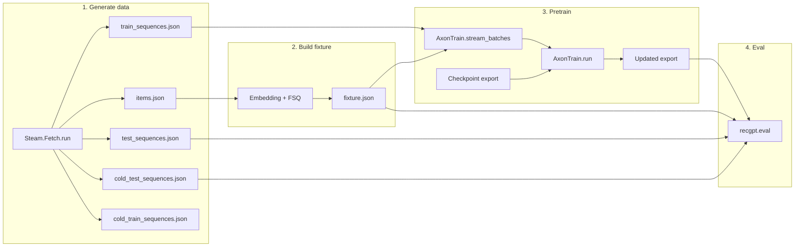

# Documentation: RecGPT Elixir library

This codebase is an Elixir library for RecGPT-style sequential recommendation (FSQ, embeddings, training, inference, gRPC serving). Docs are organized into:

- **features/** — Implemented, user-facing reference docs (API, pipeline, layers, etc.)
- **archived/** — Historical logs and completed investigations

---

## Before you start

- **Project overview:** [../README.md](../README.md) — Quick start, pipeline summary, mix tasks, tests.
- **Split from root README:** [51 Quick start](features/51_quick_start.md) · [53 Mix tasks](features/53_mix_tasks.md) · [54 Modules overview](features/54_modules_overview.md) · [55 Dependencies](features/55_dependencies.md) · [56 Dev container](features/56_dev_container.md) · [57 Tests](features/57_tests.md) · [58 gRPC serve](features/58_grpc_serve.md) · [59 Versioning and references](features/59_versioning_and_references.md).
- **Pipeline order:** 1 → 2 → 3 → 4 (Fetch → build_fixture → pretrain → eval). Fixture and checkpoint are required for pretrain and eval. To run the full flow (pretrain → catalogue → recommend), see [03 Pipeline steps — Run the whole thing](features/03_pipeline_steps.md#run-the-whole-thing-pretrain--catalogue--recommend).
- **Module reference:** [04 RecGPT library](features/04_recgpt_library.md) — Modules, dependencies, test tags.

### Pipeline overview

---

## Problem or limitation

Sequential recommendation needs a **production-ready implementation** that: (1) matches the RecGPT paradigm (FSQ, hybrid attention, text-driven items); (2) runs entirely in Elixir/BEAM without Python at runtime; (3) provides a single reproducible pipeline from data to trained model and metrics; (4) exposes recommendations via a stable, implementable API (gRPC). Without a single specification and codebase that ties these together, implementations drift and evaluation is not comparable.

---

## Proposed improvement

Deliver one **RecGPT Elixir library** that:

- **API (first):** gRPC-only; `PredictionService.Predict` (PredictRequest → PredictResponse). Authoritative contract in `recommendation.proto`; serve via `mix recgpt.serve`.
- **Pipeline:** Fetch (Steam) → build fixture (Embedding + FSQ) → pretrain (AxonTrain) → eval (Hit@k, MRR, cold). All steps have commands and options; artifact layout is defined.
- **Checkpoint:** PyTorch `.pt` or in-memory params → export (manifest + .npy) → `CheckpointLoader` → `Inference`. Key mapping and loader contract are specified.
- **Evaluation:** Held-out test and cold-test; null hypothesis rejection (Hit@1 > random); zero-shot vs trained comparison.
- **Architecture:** In-process inference; trie + beam search; optional ETS path for scaling. No Python in-repo; parity validated by tests.

---

## Verification: problem solved

This codebase ties the four requirements together in one specification and implementation. You can verify each as follows.

| Requirement                                                           | How the codebase delivers                                                                                                                                                                                                                                | How to verify                                                                                                                                                                       |
| --------------------------------------------------------------------- | -------------------------------------------------------------------------------------------------------------------------------------------------------------------------------------------------------------------------------------------------------- | ----------------------------------------------------------------------------------------------------------------------------------------------------------------------------------- |
| **(1) RecGPT paradigm** (FSQ, hybrid attention, text-driven items)    | `RecGPT.FSQ` / `FSQEncoder`, `RecGPT.Embedding` (Bumblebee/MPNet), `RecGPT.Inference` (bidirectional–causal), `RecGPT.Decode` (beam + trie). Pipeline: [02](features/02_pipeline_overview.md), [03](features/03_pipeline_steps.md); paradigm: [11](features/11_recgpt_paradigm.md). | Unit tests (FSQ, embedding, inference, decode); pipeline integration tests (`mix test`).                                                                                            |
| **(2) Elixir/BEAM only at runtime**                                   | No Python in-repo; `.pt` and pickle files are read via Elixir (Unpickler, zip). Bumblebee runs in the VM.                                                                                                                                                | `mix test`; no Python process; see [09](features/09_parity_overview.md), [10](features/10_parity_layers.md).                                                                                          |
| **(3) Single reproducible pipeline** (data → trained model → metrics) | Refetch (export_fuxi_ckpt + fetch_vae_ckpt + fetch_steam) → build_fixture → pretrain → eval. Artifact layout and options are defined.                                                                                                                                              | Run the pipeline: `mix recgpt.refetch` → `mix recgpt.first_step` (or fetch_steam + build_fixture + pretrain + eval); see [02](features/02_pipeline_overview.md), [03](features/03_pipeline_steps.md). |
| **(4) Stable, implementable API** (gRPC)                              | `recommendation.proto` defines the contract; `PredictionService.Predict`; serve via `mix recgpt.serve`.                                                                                                                                                  | Unit tests for Predict (validation, errors); full-flow test (load_state → predict); manual: `grpcurl` per [01](features/01_grpc_api.md#quick-test).                                          |

**End-to-end:** A single test exercises the full stack in-process: `Serve.load_state` (fixture + checkpoint) → state in application env → `PredictionService.Server.predict` → valid `PredictResponse`. That confirms data → model → API is wired correctly in this codebase.

### How to validate (backwards from 23)

To validate that the **library works when you use it**, run the QA checklist ([23](features/23_quality_assurance.md)). Steps 1–5 (compile, format, Credo, unit tests, Dialyzer) need no pipeline; they confirm the codebase builds and passes tests. Step 6 (Steam top-k) requires running the pipeline (fetch*steam, build_fixture, pretrain) and setting RECGPT*\* env; when it passes, the library behaves correctly with real data. That checklist is the single pass/fail gate for use.

Optionally you can also run the full pipeline yourself, run `mix recgpt.serve` and call Predict (e.g. via grpcurl per [01](features/01_grpc_api.md#quick-test)), or run eval with your own fixture and checkpoints — all of these exercise the library in use.

### Feature status

| Source                                                        | Done | Total | Notes                                                              |
| ------------------------------------------------------------- | ---- | ----- | ------------------------------------------------------------------ |
| [22 Top-tier recommendations](features/22_top_tier_recommendations.md) | 6    | 6     | All recommended improvements done.                                 |
| [10 Parity by layer](features/10_parity_layers.md)                     | 31   | 32    | 1 optional (numerical parity: Elixir forward vs reference logits). |

---

## Features (docs)

| #   | Doc                                                                                              | Summary                                                                                       |
| --- | ------------------------------------------------------------------------------------------------ | --------------------------------------------------------------------------------------------- | ------------------------------------------------------------------------------------------------------------------------------------- |
| 01  | [01 gRPC API](features/01_grpc_api.md)                                                             | Recommendation contract; Predict RPC; run server.                                             |
| 02  | [02 Pipeline overview](features/02_pipeline_overview.md)                                           | Pipeline order and Step 1. See [03](features/03_pipeline_steps.md) for steps 2–4.             |
| 03  | [03_pipeline_steps.md](features/03_pipeline_steps.md)                                           | Steps 2–4, serve, checkpoint setup, file layout.                                              | Build fixture; Pretrain; Eval; Optional serve; Env vars.                                                                              |
| 04  | [04_recgpt_library.md](features/04_recgpt_library.md)                                             | Need a single module/dependency reference for the package.                                    | By area: FSQ, Fixture, Training, Inference, Serve, Eval, Checkpoint, Data.                                                            |
| 05  | [05_eval_data_shapes.md](features/05_eval_data_shapes.md)                                        | Tests and tools need canonical JSON shapes.                                                   | Per-file: test_sequences, cold_test, items, fixture, train_sequences, cold_train.                                                     |
| 06  | [06_evaluation_and_testing.md](features/06_evaluation_and_testing.md)                            | Need to measure accuracy and reject the null baseline.                                        | Zero-shot vs trained; Null hypothesis; Held-out eval; Commands.                                                                       |
| 07  | [07_steam_splits_and_pretraining.md](features/07_steam_splits_and_pretraining.md)                | Train/test/cold semantics and artifact layout must be clear.                                  | Artifact table; cold split definition.                                                                                                |
| 08  | [08_recgpt_checkpoint_layout.md](features/08_recgpt_checkpoint_layout.md)                         | RecGPT weights are PyTorch; Elixir needs export layout and loader.                            | Components; Export; Mapping to inference.                                                                                             |
| 09  | [09_parity_overview.md](features/09_parity_overview.md)                                          | Parity at a glance and reference mapping.                                                     | At a glance; mapping; summary. See [10](features/10_parity_layers.md) for per-layer.                                                   |
| 10  | [10_parity_layers.md](features/10_parity_layers.md)                                              | Per-layer parity task lists and validation.                                                   | Embeddings; FSQ; Training; Forward; Decode; Checkpoint; E2E.                                                                          |
| 11  | [11_recgpt_paradigm.md](features/11_recgpt_paradigm.md)                                           | Algorithmic foundations must be documented.                                                   | FSQ and semantic tokenization; Hybrid attention; Pipeline and modules.                                                                |
| 12  | [12_dynamic_state_ets.md](features/12_dynamic_state_ets.md)                                      | Decoding must be catalog-aware; scaling may need ETS.                                         | Trie; Beam search; Future ETS.                                                                                                        |
| 13  | [13_infrastructure_serving.md](features/13_infrastructure_serving.md)                            | Serving and deployment must be specified.                                                     | In-process inference; Run serve; Optional Triton/edge.                                                                                |
| 14  | [14_architecture_references.md](features/14_architecture_references.md)                          | Claims and design must be citable.                                                            | Works cited (RecGPT, beam/trie, ETS, gRPC).                                                                                           |
| 15  | [15_layers_overview.md](features/15_layers_overview.md)                                          | Layer diagram and summary table.                                                              | Six layers; dependency rule. See [16](features/16_layer_artifacts.md)-[21](features/21_layer_application.md) for per-layer.             |
| 16  | [16_layer_artifacts.md](features/16_layer_artifacts.md)                                         | Layer 1: Artifacts.                                                                           | Steam.Fetch, PtLoader, CheckpointLoader, CheckpointExport.                                                                            |
| 17  | [17_layer_representation.md](features/17_layer_representation.md)                                 | Layer 2: Representation.                                                                      | FSQ, FSQEncoder, Embedding.                                                                                                           |
| 18  | [18_layer_fixture.md](features/18_layer_fixture.md)                                              | Layer 3: Fixture.                                                                             | FixtureBuild.                                                                                                                         |
| 19  | [19_layer_model.md](features/19_layer_model.md)                                                  | Layer 4: Model.                                                                               | Inference, Training, AxonTrain.                                                                                                       |
| 20  | [20_layer_recommendation.md](features/20_layer_recommendation.md)                                 | Layer 5: Recommendation.                                                                      | Trie, Decode, Serve.                                                                                                                  |
| 21  | [21_layer_application.md](features/21_layer_application.md)                                      | Layer 6: Application.                                                                         | Eval, PredictionService, GRPCEndpoint.                                                                                                |
| 22  | [22_top_tier_recommendations.md](features/22_top_tier_recommendations.md)                         | Elevate the library to production-grade quality.                                              | Typespecs/Dialyzer; integration test; health; property tests; benchmarks; release.                                                    |
| 23  | [23_quality_assurance.md](features/23_quality_assurance.md)                                    | Run the QA checklist before merge or release.                                                 | Compile, format, Credo, unit tests, Dialyzer; Steam top-k; CI.                                                                        |
| 29  | [29_staff_api.md](features/29_staff_api.md)                                                     | Staff API for catalogues, sequences, fixture, pretrain.                                       | RecGPT.StaffApi behaviour; list/upsert items; sync sequences; build_fixture; pretrain; set_canonical_texts.                           |
| 30  | [30_waffle_ecto_usage.md](features/30_waffle_ecto_usage.md)                                     | Blob storage with Ecto and optional object store.                                             | waffle_ecto + Waffle: schema, cast_attachments, local/S3 config.                                                                      |
| 31  | [31_ycsb_storage_classification.md](features/31_ycsb_storage_classification.md)                   | Classify storage by YCSB workload types and throughput.                                       | YCSB A–F; database/store fit; RecGPT artifact mapping.                                                                                |
| 32  | [32_spmd_decode_flow.md](features/32_spmd_decode_flow.md)                                       | Minimize CPU–device sync in beam search; keep trie and scoring on device.                     | Trie tensors; SPMD beam search; single sync; lib/ modules (Trie, Decode, Serve).                                                      |
| 42  | [42 Latency and performance](features/42_latency_and_performance.md)                              | Industry context, batched inference, KV-cache, SLO targets.                                   | P50/P99 targets; latency_flow.                                                                                                        |
| 51  | [51 Quick start](features/51_quick_start.md)                                                    | Getting started; run the pipeline.                                                            | Split from root README.                                                                                                               |
| 53  | [53 Mix tasks](features/53_mix_tasks.md)                                                         | Commands and options.                                                                         | Split from root README.                                                                                                               |
| 54  | [54 Modules overview](features/54_modules_overview.md)                                            | Module reference.                                                                             | Split from root README.                                                                                                               |
| 55  | [55 Dependencies](features/55_dependencies.md)                                                   | Nx, EXLA, Bumblebee, etc.                                                                     | Split from root README.                                                                                                               |
| 56  | [56 Dev container](features/56_dev_container.md)                                                 | Torchx dev container setup.                                                                  | Split from root README.                                                                                                               |
| 57  | [57 Tests](features/57_tests.md)                                                                 | Running tests.                                                                                | Split from root README.                                                                                                               |
| 58  | [58 gRPC serve](features/58_grpc_serve.md)                                                       | gRPC API and serve.                                                                           | Split from root README.                                                                                                               |
| 59  | [59 Versioning and references](features/59_versioning_and_references.md)                          | Versioning and refs.                                                                          | Split from root README.                                                                                                               |
| 63  | [63 Investigation: RecGPT old vs current](archived/63_investigation_recgpt_old_vs_current.md)   | Comparison and migration.                                                                     | Investigation.                                                                                                                        |
| 64  | [64 Investigation: recgpt-trajectories dataset](archived/64_investigation_recgpt_trajectories_dataset.md) | Trajectories dataset for pretraining.                                                         | Investigation.                                                                                                                        |
| 87  | [87 MovieLens training signal log](archived/87_movielens_training_signal_log.md)               | MovieLens-20M pretrain run: loss 8.87 → 0.53 in 200 iters.                                  | Log; pipeline commands.                                                                                                              |
| 89  | [89 FuXi latency log](archived/89_fuxi_latency_log.md)                                        | FuXi vs GPT-2 latency on RTX 4090; ~179 ms mean (FuXi) vs ~189 ms (GPT-2).                   | Latency comparison; trace_predict.                                                                                                    |
| 90  | [90 Train–test loss loop](features/90_train_test_loss_loop.md)                                | `--eval-test-every --test` for train/test loss progress; best test loss tracking.             | Generalization; early stopping.                                                                                                        |
| 65  | [65 Latency flow](features/65_latency_flow.md)                                                  | E2E flow diagram, per-stage optimization.                                                     | GPU tensor graph.                                                                                                                     |
| 66  | [66 Nsight Systems tracing](features/66_nsys_tracing.md)                                        | Profile with nsys and NVTX.                                                                   | nsys, NVTX.                                                                                                                           |
| 78  | [78 Bulk data not in git](features/78_bulk_data_not_in_git.md)                                  | What bulk data exists (data/, checkpoints); gitignored; how to save/restore.                   | Inventory; back up strategy.                                                                                                         |
| 85  | [85 FuXi-Linear status](features/85_fuxi_linear_status.md)                                       | Implemented: Serve, AxonTrain, export_fuxi_ckpt, all_timestamps, chunk_size.                   | Implementation status.                                                                                                                |
| 91  | [91 FuXi-Linear real timestamps](features/91_fuxi_linear_real_timestamps.md)                      | Pass real timestamps to FuXi-Linear; prediction-market aligned; rope bridge.                  | Converter, DB, training, Serve; leader sequence format.                                                                               |
| 93  | [93 Pretraining plan](features/93_pretraining_plan.md)                                            | Phase 1: KuaiRand-Pure; prove signal at FuXi metrics (loss).                                  | File-based convert → build_fixture → pretrain; eval-test-every.                                                                      |
| 94  | [94 Video-domain trajectory test](features/94_video_domain_trajectory_test.md)                    | Design: video analogue of trade test — next-video prediction on user watch trajectories.       | Data model; pipeline; session vs user; timestamps; cold videos; contrast with prediction market.                                     |

---

## Quick reference (actionable)

| I want to…                                         | See                                                                                                                                                                                         |
| -------------------------------------------------- | ------------------------------------------------------------------------------------------------------------------------------------------------------------------------------------------- |
| **Call the recommendation API (gRPC)**             | [01 gRPC API](features/01_grpc_api.md), [recommendation.proto](../priv/proto/recgpt/v1/recommendation.proto), `mix recgpt.serve`                                                                     |
| Run the full pipeline                              | [02 Pipeline overview](features/02_pipeline_overview.md), [03 Pipeline steps](features/03_pipeline_steps.md), [../README.md](../README.md#pipeline)                                             |
| Find a module's purpose and API                    | [04 RecGPT library](features/04_recgpt_library.md)                                                                                                                         |
| Generate or use test/fixture JSON                  | [05 Eval data shapes](features/05_eval_data_shapes.md)                                                                                                                      |
| Run eval and interpret metrics                     | [06 Evaluation and testing](features/06_evaluation_and_testing.md)                                                                                                          |
| Understand cold vs regular splits                  | [07 Steam splits and pretraining](features/07_steam_splits_and_pretraining.md)                                                                                               |
| Export or load a checkpoint                        | [08 Checkpoint layout](features/08_recgpt_checkpoint_layout.md)                                                                                                              |
| Use SQLite/Ecto for catalog storage                | [13 Infrastructure](features/13_infrastructure_serving.md#catalog-storage-object-store-semantics)                                                                            |
| Store blobs with Ecto (local or S3/GCS)            | [30 waffle_ecto usage](features/30_waffle_ecto_usage.md) — waffle_ecto + Waffle for attachments and optional object store.                                                |
| Classify storage by YCSB types and throughput      | [31 YCSB storage classification](features/31_ycsb_storage_classification.md) — workload types A–F, database fit, RecGPT artifact mapping.                                  |
| Design catalog/DB schema (ETNF)                    | [ETNF database design](features/etnf_database_design.md)                                                                                                                      |
| Understand layers and test strategy                | [15 Layers overview](features/15_layers_overview.md), [16](features/16_layer_artifacts.md)–[21](features/21_layer_application.md) layer docs.                                 |
| Make the library top tier                          | [22 Top-tier recommendations](features/22_top_tier_recommendations.md)                                                                                                       |
| Run the QA checklist                               | [23 Quality assurance](features/23_quality_assurance.md)                                                                                                                     |
| **Build a staff API (catalogues, pretrain, etc.)** | [29 Staff API](features/29_staff_api.md) — RecGPT.StaffApi: list/upsert items, sync sequences, build_fixture, pretrain.                                                      |
| **Bulk data (not in git)**                         | [78 Bulk data not in git](features/78_bulk_data_not_in_git.md) — `mix recgpt.refetch`; what to back up.                                                                     |
| Understand SPMD decode (trie tensors, single sync) | [32 SPMD decode flow](features/32_spmd_decode_flow.md) — Trie.to_tensors, Decode.beam_search_top_k_spmd, Serve.recommend.                                                    |
| Quick start, pipeline, mix tasks, tests, etc.      | [51](features/51_quick_start.md)–[59](features/59_versioning_and_references.md) — Split from root README.                                                                     |
| **Latency flow, nsys, FuXi**                       | [65 Latency flow](features/65_latency_flow.md), [66 Nsight Systems](features/66_nsys_tracing.md), [89 FuXi latency log](archived/89_fuxi_latency_log.md).                    |
| **Investigations**                                 | [63](archived/63_investigation_recgpt_old_vs_current.md), [64](archived/64_investigation_recgpt_trajectories_dataset.md).                                                     |
| **Phase 1 pretraining**                            | [93 Pretraining plan](features/93_pretraining_plan.md) — KuaiRand-Pure; prove signal at FuXi loss.                                                             |
| **Video-domain trajectory test (design)**         | [94 Video-domain trajectory test](features/94_video_domain_trajectory_test.md) — Next-video eval on watch trajectories; design choices.                       |
| **First step (Steam baseline)**                    | One-shot: `mix recgpt.first_step` (requires checkpoint).                                                                                                                     |
| Read the architecture blueprint                    | [11 Paradigm](features/11_recgpt_paradigm.md), [12 Dynamic state](features/12_dynamic_state_ets.md), [13 Infrastructure](features/13_infrastructure_serving.md)              |

---

## See also

- [01 gRPC API](features/01_grpc_api.md) — Recommendation API contract and server.
- [02 Pipeline overview](features/02_pipeline_overview.md) — Pipeline order and Step 1.
- [04 RecGPT library](features/04_recgpt_library.md) — Module reference.
- [15 Layers overview](features/15_layers_overview.md) — Layer diagram and table.
- [ETNF database design](features/etnf_database_design.md) — Essential Tuple Normal Form for catalog/embedding schemas.
- [65 Latency flow](features/65_latency_flow.md), [89 FuXi latency log](archived/89_fuxi_latency_log.md).
