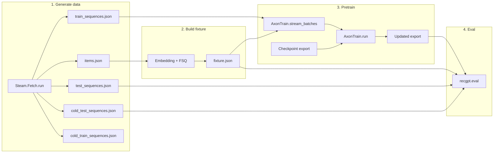

# Proposal: RecGPT Elixir library

This codebase is **one proposal**: an Elixir library for RecGPT-style sequential recommendation (FSQ, embeddings, training, inference, gRPC serving). Docs are in **user-facing order**: **gRPC API first**, then pipeline, library, data, eval, checkpoint, parity, and architecture. Each doc is a sub-proposal (problem → proposed improvement → sub-proposals). Start here, then follow links recursively.

---

## Before you start

- **Project overview:** [../README.md](../README.md) — Quick start, pipeline summary, mix tasks, tests.
- **Pipeline order:** 1 → 2 → 3 → 4 (Fetch → build_fixture → pretrain → eval). Fixture and checkpoint are required for pretrain and eval.
- **Module reference:** [03 RecGPT library](03_recgpt_library.md) — Modules, dependencies, test tags.

### Pipeline overview

---

## Problem or limitation

Sequential recommendation needs a **production-ready implementation** that: (1) matches the RecGPT paradigm (FSQ, hybrid attention, text-driven items); (2) runs entirely in Elixir/BEAM without Python at runtime; (3) provides a single reproducible pipeline from data to trained model and metrics; (4) exposes recommendations via a stable, implementable API (gRPC). Without a single specification and codebase that ties these together, implementations drift and evaluation is not comparable.

---

## Proposed improvement

Deliver one **RecGPT Elixir library** that:

- **API (first):** gRPC-only; `PredictionService.Predict` (PredictRequest → PredictResponse). Authoritative contract in `recommendation.proto`; serve via `mix recgpt.serve`.
- **Pipeline:** Fetch (Steam) → build fixture (Embedding + FSQ) → pretrain (AxonTrain) → eval (Hit@k, MRR, cold). All steps have commands and options; artifact layout is defined.
- **Checkpoint:** PyTorch `.pt` or in-memory params → export (manifest + .npy) → `CheckpointLoader` → `Inference`. Key mapping and loader contract are specified.
- **Evaluation:** Held-out test and cold-test; null hypothesis rejection (Hit@1 > random); zero-shot vs trained comparison.
- **Architecture:** In-process inference; trie + beam search; optional ETS path for scaling. No Python in-repo; parity validated by tests.

Design is **specific and actionable**: each sub-proposal below can be implemented or extended from the doc alone.

---

## Sub-proposals (user-facing order)

| #   | Proposal                                                                   | Problem / limitation                                               | Sub-proposals                                                                     |
| --- | -------------------------------------------------------------------------- | ------------------------------------------------------------------ | --------------------------------------------------------------------------------- |
| 01  | [01_grpc_api.md](01_grpc_api.md)                                           | Recommendation must have a stable, implementable contract.         | Predict RPC; Errors; Run the server.                                              |
| 02  | [02_pipeline_reference.md](02_pipeline_reference.md)                       | Need one reproducible path from data to metrics.                   | Step 1–4: Generate data, Build fixture, Pretrain, Eval.                           |
| 03  | [03_recgpt_library.md](03_recgpt_library.md)                               | Need a single module/dependency reference for the package.         | By area: FSQ, Fixture, Training, Inference, Serve, Eval, Checkpoint, Data.        |
| 04  | [04_eval_data_shapes.md](04_eval_data_shapes.md)                           | Tests and tools need canonical JSON shapes.                        | Per-file: test_sequences, cold_test, items, fixture, train_sequences, cold_train. |
| 05  | [05_evaluation_and_testing.md](05_evaluation_and_testing.md)               | Need to measure accuracy and reject the null baseline.             | Zero-shot vs trained; Null hypothesis; Held-out eval; Commands.                   |
| 06  | [06_steam_splits_and_pretraining.md](06_steam_splits_and_pretraining.md)   | Train/test/cold semantics and artifact layout must be clear.       | Artifact table; cold split definition.                                            |
| 07  | [07_recgpt_checkpoint_layout.md](07_recgpt_checkpoint_layout.md)           | RecGPT weights are PyTorch; Elixir needs export layout and loader. | Components; Export; Mapping to inference.                                         |
| 08  | [08_python_recgpt_parity_progress.md](08_python_recgpt_parity_progress.md) | Track implementation vs. Python RecGPT without Python in-repo.     | By layer: Embeddings, FSQ, Training, Forward, Decode, Checkpoint, E2E.            |
| 09  | [09_recgpt_paradigm.md](09_recgpt_paradigm.md)                             | Algorithmic foundations must be documented.                        | FSQ and semantic tokenization; Hybrid attention; Pipeline and modules.            |
| 10  | [10_dynamic_state_ets.md](10_dynamic_state_ets.md)                         | Decoding must be catalog-aware; scaling may need ETS.              | Trie; Beam search; Future ETS.                                                    |
| 11  | [11_infrastructure_serving.md](11_infrastructure_serving.md)               | Serving and deployment must be specified.                          | In-process inference; Run serve; Optional Triton/edge.                            |
| 12  | [12_architecture_references.md](12_architecture_references.md)             | Claims and design must be citable.                                 | Works cited (RecGPT, beam/trie, ETS, gRPC).                                       |

---

## Quick reference (actionable)

| I want to…                             | See                                                                                                                                  |
| -------------------------------------- | ------------------------------------------------------------------------------------------------------------------------------------ |
| **Call the recommendation API (gRPC)** | [01 gRPC API](01_grpc_api.md), [recommendation.proto](../priv/proto/recgpt/v1/recommendation.proto), `mix recgpt.serve`              |
| Run the full pipeline                  | [02 Pipeline reference](02_pipeline_reference.md), [../README.md](../README.md#pipeline)                                             |
| Find a module's purpose and API        | [03 RecGPT library](03_recgpt_library.md)                                                                                            |
| Generate or use test/fixture JSON      | [04 Eval data shapes](04_eval_data_shapes.md)                                                                                        |
| Run eval and interpret metrics         | [05 Evaluation and testing](05_evaluation_and_testing.md)                                                                            |
| Understand cold vs regular splits      | [06 Steam splits and pretraining](06_steam_splits_and_pretraining.md)                                                                |
| Export or load a checkpoint            | [07 Checkpoint layout](07_recgpt_checkpoint_layout.md)                                                                               |
| Read the architecture blueprint        | [09 Paradigm](09_recgpt_paradigm.md), [10 Dynamic state](10_dynamic_state_ets.md), [11 Infrastructure](11_infrastructure_serving.md) |
