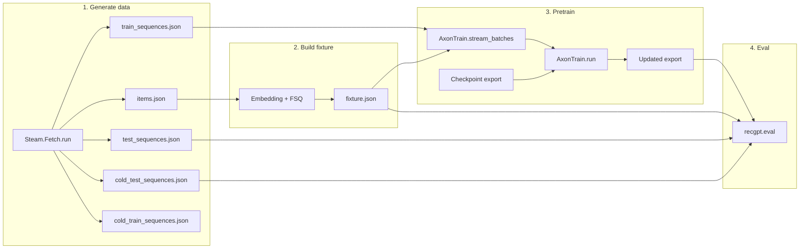

# Proposal: RecGPT Elixir library

This codebase is **one proposal**: an Elixir library for RecGPT-style sequential recommendation (FSQ, embeddings, training, inference, gRPC serving). Docs are in **user-facing order**: **gRPC API first**, then pipeline, library, data, eval, checkpoint, parity, and architecture. Each doc is a sub-proposal (problem → proposed improvement → sub-proposals). Start here, then follow links recursively.

**Standardized sections:** Every doc uses `## Problem or limitation`, `## Proposed improvement`, then any topic sections, and ends with `---` and `## See also`. Layer docs (16–21) use the same template; responsibility, public surface, and how to test are in the Proposed improvement section.

---

## Before you start

- **Project overview:** [../README.md](../README.md) — Quick start, pipeline summary, mix tasks, tests.
- **Split from root README:** [51 Quick start](51_quick_start.md) · [52 Pipeline summary](52_pipeline_summary.md) · [53 Mix tasks](53_mix_tasks.md) · [54 Modules overview](54_modules_overview.md) · [55 Dependencies](55_dependencies.md) · [56 Dev container](56_dev_container.md) · [57 Tests](57_tests.md) · [58 gRPC serve](58_grpc_serve.md) · [59 Versioning and references](59_versioning_and_references.md).
- **Pipeline order:** 1 → 2 → 3 → 4 (Fetch → build_fixture → pretrain → eval). Fixture and checkpoint are required for pretrain and eval. To run the full flow (pretrain → catalogue → recommend), see [03 Pipeline steps — Run the whole thing](03_pipeline_steps.md#run-the-whole-thing-pretrain--catalogue--recommend).
- **Module reference:** [04 RecGPT library](04_recgpt_library.md) — Modules, dependencies, test tags.

### Pipeline overview

---

## Problem or limitation

Sequential recommendation needs a **production-ready implementation** that: (1) matches the RecGPT paradigm (FSQ, hybrid attention, text-driven items); (2) runs entirely in Elixir/BEAM without Python at runtime; (3) provides a single reproducible pipeline from data to trained model and metrics; (4) exposes recommendations via a stable, implementable API (gRPC). Without a single specification and codebase that ties these together, implementations drift and evaluation is not comparable.

---

## Proposed improvement

Deliver one **RecGPT Elixir library** that:

- **API (first):** gRPC-only; `PredictionService.Predict` (PredictRequest → PredictResponse). Authoritative contract in `recommendation.proto`; serve via `mix recgpt.serve`.
- **Pipeline:** Fetch (Steam) → build fixture (Embedding + FSQ) → pretrain (AxonTrain) → eval (Hit@k, MRR, cold). All steps have commands and options; artifact layout is defined.
- **Checkpoint:** PyTorch `.pt` or in-memory params → export (manifest + .npy) → `CheckpointLoader` → `Inference`. Key mapping and loader contract are specified.
- **Evaluation:** Held-out test and cold-test; null hypothesis rejection (Hit@1 > random); zero-shot vs trained comparison.
- **Architecture:** In-process inference; trie + beam search; optional ETS path for scaling. No Python in-repo; parity validated by tests.

Design is **specific and actionable**: each sub-proposal below can be implemented or extended from the doc alone.

---

## Verification: problem solved

This codebase ties the four requirements together in one specification and implementation. You can verify each as follows.

| Requirement                                                           | How the codebase delivers                                                                                                                                                                                                                                | How to verify                                                                                                                                                                       |
| --------------------------------------------------------------------- | -------------------------------------------------------------------------------------------------------------------------------------------------------------------------------------------------------------------------------------------------------- | ----------------------------------------------------------------------------------------------------------------------------------------------------------------------------------- |
| **(1) RecGPT paradigm** (FSQ, hybrid attention, text-driven items)    | `RecGPT.FSQ` / `FSQEncoder`, `RecGPT.Embedding` (Bumblebee/MPNet), `RecGPT.Inference` (bidirectional–causal), `RecGPT.Decode` (beam + trie). Pipeline: [02](02_pipeline_overview.md), [03](03_pipeline_steps.md); paradigm: [11](11_recgpt_paradigm.md). | Unit tests (FSQ, embedding, inference, decode); pipeline integration tests (`mix test`).                                                                                            |
| **(2) Elixir/BEAM only at runtime**                                   | No Python in-repo; `.pt` and pickle files are read via Elixir (Unpickler, zip). Bumblebee runs in the VM.                                                                                                                                                | `mix test`; no Python process; see [09](09_parity_overview.md), [10](10_parity_layers.md).                                                                                          |
| **(3) Single reproducible pipeline** (data → trained model → metrics) | Four steps with commands: Fetch → build_fixture → pretrain → eval. Artifact layout and options are defined.                                                                                                                                              | Run the pipeline: `mix recgpt.fetch_steam` → `mix recgpt.build_fixture` → `mix recgpt.pretrain` → `mix recgpt.eval`; see [02](02_pipeline_overview.md), [03](03_pipeline_steps.md). |
| **(4) Stable, implementable API** (gRPC)                              | `recommendation.proto` defines the contract; `PredictionService.Predict`; serve via `mix recgpt.serve`.                                                                                                                                                  | Unit tests for Predict (validation, errors); full-flow test (load_state → predict); manual: `grpcurl` per [01](01_grpc_api.md#quick-test).                                          |

**End-to-end:** A single test exercises the full stack in-process: `Serve.load_state` (fixture + checkpoint) → state in application env → `PredictionService.Server.predict` → valid `PredictResponse`. That confirms data → model → API is wired correctly in this codebase.

### How to validate (backwards from 23)

To validate that the **library works when you use it**, run the QA checklist ([23](23_quality_assurance.md)). Steps 1–5 (compile, format, Credo, unit tests, Dialyzer) need no pipeline; they confirm the codebase builds and passes tests. Step 6 (Steam top-k) requires running the pipeline (fetch*steam, build_fixture, pretrain) and setting RECGPT*\* env; when it passes, the library behaves correctly with real data. That checklist is the single pass/fail gate for use.

Optionally you can also run the full pipeline yourself, run `mix recgpt.serve` and call Predict (e.g. via grpcurl per [01](01_grpc_api.md#quick-test)), or run eval with your own fixture and checkpoints — all of these exercise the library in use.

### Feature status

| Source                                                        | Done | Total | Notes                                                              |
| ------------------------------------------------------------- | ---- | ----- | ------------------------------------------------------------------ |
| [22 Top-tier recommendations](22_top_tier_recommendations.md) | 6    | 6     | All recommended improvements done.                                 |
| [10 Parity by layer](10_parity_layers.md)                     | 31   | 32    | 1 optional (numerical parity: Elixir forward vs reference logits). |

---

## Sub-proposals (user-facing order)

| #   | Proposal                                                                                         | Problem / limitation                                                                          | Sub-proposals                                                                                                                         |
| --- | ------------------------------------------------------------------------------------------------ | --------------------------------------------------------------------------------------------- | ------------------------------------------------------------------------------------------------------------------------------------- |
| 01  | [01_grpc_api.md](01_grpc_api.md)                                                                 | Recommendation must have a stable, implementable contract.                                    | Predict RPC; Errors; Run the server.                                                                                                  |
| 02  | [02_pipeline_overview.md](02_pipeline_overview.md)                                               | Pipeline order and Step 1 (generate data).                                                    | Overview; Step 1. See [03](03_pipeline_steps.md) for steps 2–4, serve, layout.                                                        |
| 03  | [03_pipeline_steps.md](03_pipeline_steps.md)                                                     | Steps 2–4, serve, checkpoint setup, file layout.                                              | Build fixture; Pretrain; Eval; Optional serve; Env vars.                                                                              |
| 04  | [04_recgpt_library.md](04_recgpt_library.md)                                                     | Need a single module/dependency reference for the package.                                    | By area: FSQ, Fixture, Training, Inference, Serve, Eval, Checkpoint, Data.                                                            |
| 05  | [05_eval_data_shapes.md](05_eval_data_shapes.md)                                                 | Tests and tools need canonical JSON shapes.                                                   | Per-file: test_sequences, cold_test, items, fixture, train_sequences, cold_train.                                                     |
| 06  | [06_evaluation_and_testing.md](06_evaluation_and_testing.md)                                     | Need to measure accuracy and reject the null baseline.                                        | Zero-shot vs trained; Null hypothesis; Held-out eval; Commands.                                                                       |
| 07  | [07_steam_splits_and_pretraining.md](07_steam_splits_and_pretraining.md)                         | Train/test/cold semantics and artifact layout must be clear.                                  | Artifact table; cold split definition.                                                                                                |
| 08  | [08_recgpt_checkpoint_layout.md](08_recgpt_checkpoint_layout.md)                                 | RecGPT weights are PyTorch; Elixir needs export layout and loader.                            | Components; Export; Mapping to inference.                                                                                             |
| 09  | [09_parity_overview.md](09_parity_overview.md)                                                   | Parity at a glance and reference mapping.                                                     | At a glance; mapping; summary. See [10](10_parity_layers.md) for per-layer.                                                           |
| 10  | [10_parity_layers.md](10_parity_layers.md)                                                       | Per-layer parity task lists and validation.                                                   | Embeddings; FSQ; Training; Forward; Decode; Checkpoint; E2E.                                                                          |
| 11  | [11_recgpt_paradigm.md](11_recgpt_paradigm.md)                                                   | Algorithmic foundations must be documented.                                                   | FSQ and semantic tokenization; Hybrid attention; Pipeline and modules.                                                                |
| 12  | [12_dynamic_state_ets.md](12_dynamic_state_ets.md)                                               | Decoding must be catalog-aware; scaling may need ETS.                                         | Trie; Beam search; Future ETS.                                                                                                        |
| 13  | [13_infrastructure_serving.md](13_infrastructure_serving.md)                                     | Serving and deployment must be specified.                                                     | In-process inference; Run serve; Optional Triton/edge.                                                                                |
| 14  | [14_architecture_references.md](14_architecture_references.md)                                   | Claims and design must be citable.                                                            | Works cited (RecGPT, beam/trie, ETS, gRPC).                                                                                           |
| 15  | [15_layers_overview.md](15_layers_overview.md)                                                   | Layer diagram and summary table.                                                              | Six layers; dependency rule. See [16](16_layer_artifacts.md)-[21](21_layer_application.md) for per-layer.                             |
| 16  | [16_layer_artifacts.md](16_layer_artifacts.md)                                                   | Layer 1: Artifacts.                                                                           | Steam.Fetch, PtLoader, CheckpointLoader, CheckpointExport.                                                                            |
| 17  | [17_layer_representation.md](17_layer_representation.md)                                         | Layer 2: Representation.                                                                      | FSQ, FSQEncoder, Embedding.                                                                                                           |
| 18  | [18_layer_fixture.md](18_layer_fixture.md)                                                       | Layer 3: Fixture.                                                                             | FixtureBuild.                                                                                                                         |
| 19  | [19_layer_model.md](19_layer_model.md)                                                           | Layer 4: Model.                                                                               | Inference, Training, AxonTrain.                                                                                                       |
| 20  | [20_layer_recommendation.md](20_layer_recommendation.md)                                         | Layer 5: Recommendation.                                                                      | Trie, Decode, Serve.                                                                                                                  |
| 21  | [21_layer_application.md](21_layer_application.md)                                               | Layer 6: Application.                                                                         | Eval, PredictionService, GRPCEndpoint.                                                                                                |
| 22  | [22_top_tier_recommendations.md](22_top_tier_recommendations.md)                                 | Elevate the library to production-grade quality.                                              | Typespecs/Dialyzer; integration test; health; property tests; benchmarks; release.                                                    |
| —   | [embedding_vs_eval.md](embedding_vs_eval.md)                                                     | Divide: embeddings vs eval.                                                                   | Generating embeddings (parity, .npy) vs testing recommendation performance (Hit@k, MRR, serve).                                       |
| 27  | [27 Freeze inputs for layer isolation](27_freeze_inputs_layer_isolation.md)                      | Isolate layers with frozen inputs (unit/property tests).                                      | Problem/Proposed; Unit tests and property testing; Layer boundaries; Implementation; See also.                                        |
| 23  | [23_quality_assurance.md](23_quality_assurance.md)                                               | Run the QA checklist before merge or release.                                                 | Compile, format, Credo, unit tests, Dialyzer; Steam top-k; CI.                                                                        |
| 24  | [24_first_step_plan.md](24_first_step_plan.md)                                                   | First step: Steam test vectors (baseline).                                                    | Why Steam first; get data, build fixture, run eval; outcome.                                                                          |
| 25  | [25_mvp_guard_rails.md](25_mvp_guard_rails.md)                                                   | Keep rope bridge on track.                                                                    | Guard rails (tombstones); no multi-rank/sharding until minimal loop closed.                                                           |
| 26  | [26_embedding_mismatch.md](26_embedding_mismatch.md)                                             | Embedding parity gap and workaround.                                                          | Text format; compare_embeddings; use dataset .npy.                                                                                    |
| 28  | [28_thirdparty_vs_elixir_parity.md](28_thirdparty_vs_elixir_parity.md)                           | Parity with released model (dataset .npy + VAE).                                              | Embeddings and FSQ sources; use dataset .npy + VAE for FSQ; Elixir-only path.                                                         |
| 29  | [29_staff_api.md](29_staff_api.md)                                                               | Staff API for catalogues, sequences, fixture, pretrain.                                       | RecGPT.StaffApi behaviour; list/upsert items; sync sequences; build_fixture; pretrain; set_canonical_texts.                           |
| 30  | [30_waffle_ecto_usage.md](30_waffle_ecto_usage.md)                                               | Blob storage with Ecto and optional object store.                                             | waffle_ecto + Waffle: schema, cast_attachments, local/S3 config.                                                                      |
| 31  | [31_ycsb_storage_classification.md](31_ycsb_storage_classification.md)                           | Classify storage by YCSB workload types and throughput.                                       | YCSB A–F; database/store fit; RecGPT artifact mapping.                                                                                |
| 32  | [32_spmd_decode_flow.md](32_spmd_decode_flow.md)                                                 | Minimize CPU–device sync in beam search; keep trie and scoring on device.                     | Trie tensors; SPMD beam search; single sync; lib/ modules (Trie, Decode, Serve).                                                      |
| 34  | [34 Sniper Mode Moneyball](34_sniper_mode_moneyball_strategy.md)                                 | Scout + Gatekeeper; JSON-LD/XMP; Moneyball metrics.                                           | [35](35_sniper_architecture.md)–[41](41_sniper_path_profitable.md): arch, schema, gamed-ness, Qwen LoRA, triple-lock, pipeline, path. |
| 35  | [35 Sniper Architecture](35_sniper_architecture.md)                                              | Scout + Gatekeeper; RecGPT pretraining vs Qwen LoRA.                                          | Part of 34.                                                                                                                           |
| 36  | [36 Sniper Schema](36_sniper_schema.md)                                                          | JSON-LD + XMP-JSON-LD (Tape, guardrails).                                                     | Part of 34.                                                                                                                           |
| 37  | [37 Sniper Gamed-ness + Metrics](37_sniper_gamedness_metrics.md)                                 | Butterfly under gamed-ness; Moneyball metrics.                                                | Part of 34.                                                                                                                           |
| 38  | [38 Sniper Qwen LoRA](38_sniper_qwen_lora.md)                                                    | GRPO reward, ART rollout, training loop.                                                      | Part of 34.                                                                                                                           |
| 39  | [39 Sniper Triple-Lock + Execution](39_sniper_triple_lock_execution.md)                          | Gatekeeper criteria; Zero-Reserve flow.                                                       | Part of 34.                                                                                                                           |
| 40  | [40 Sniper Pipeline + Continuum](40_sniper_pipeline_continuum.md)                                | N→N+3; Head / Mid-Tail / Long Tail.                                                           | Part of 34.                                                                                                                           |
| 41  | [41 Sniper Path to Profitable](41_sniper_path_profitable.md)                                     | POLYMARKET_PROFITABLE_PCT dimensions.                                                         | Part of 34.                                                                                                                           |
| 42  | [42 Latency and performance](42_latency_and_performance.md)                                      | Industry context, batched inference, KV-cache, SLO targets.                                   | P50/P99 targets; latency_flow.                                                                                                        |
| 50  | [50 Virix Polymarket strategy review](50_virix_polymarket_strategy_review.md)                    | Review Ilya/Virix Labs Twitter strategy; relevance to Sniper.                                 | Wallet scanner, CLOB, signal pipeline; mapping to N+2, Fat Head bypass, Triple-Lock.                                                  |
| 51  | [51 Quick start](51_quick_start.md)                                                              | Getting started; run the pipeline.                                                            | Split from root README.                                                                                                               |
| 52  | [52 Pipeline summary](52_pipeline_summary.md)                                                    | Pipeline overview.                                                                            | Split from root README.                                                                                                               |
| 53  | [53 Mix tasks](53_mix_tasks.md)                                                                  | Commands and options.                                                                         | Split from root README.                                                                                                               |
| 54  | [54 Modules overview](54_modules_overview.md)                                                    | Module reference.                                                                             | Split from root README.                                                                                                               |
| 55  | [55 Dependencies](55_dependencies.md)                                                            | Nx, Torchx, Bumblebee, etc.                                                                   | Split from root README.                                                                                                               |
| 56  | [56 Dev container](56_dev_container.md)                                                          | Torchx dev container setup.                                                                  | Split from root README.                                                                                                               |
| 57  | [57 Tests](57_tests.md)                                                                          | Running tests.                                                                                | Split from root README.                                                                                                               |
| 58  | [58 gRPC serve](58_grpc_serve.md)                                                                | gRPC API and serve.                                                                           | Split from root README.                                                                                                               |
| 59  | [59 Versioning and references](59_versioning_and_references.md)                                  | Versioning and refs.                                                                          | Split from root README.                                                                                                               |
| 60  | [60 Rope bridge market analytics](60_rope_bridge_market_analytics_plan.md)                       | Paper trading; survivorship; Kelly, Greeks; path to 12.7%.                                    | Profit calc, Scout→butterfly, solver.                                                                                                 |
| 61  | [61 Strategy given latency ceiling](61_strategy_given_latency_ceiling.md)                        | RecGPT fits Catalyst/Combinatorial; bypass Binary/Bundle.                                     | Latency constraint framework.                                                                                                         |
| 62  | [62 Ablation tensor graph](62_ablation_tensor_graph.md)                                          | What can be removed without breaking semantic id or top-k.                                    | Tensor graph, decode path.                                                                                                            |
| 63  | [63 Investigation: RecGPT old vs current](63_investigation_recgpt_old_vs_current.md)             | Comparison and migration.                                                                     | Investigation.                                                                                                                        |
| 64  | [64 Investigation: recgpt-trajectories dataset](64_investigation_recgpt_trajectories_dataset.md) | Trajectories dataset for pretraining.                                                         | Investigation.                                                                                                                        |
| 65  | [65 Latency flow](65_latency_flow.md)                                                            | E2E flow diagram, per-stage optimization.                                                     | GPU tensor graph.                                                                                                                     |
| 66  | [66 Nsight Systems tracing](66_nsys_tracing.md)                                                  | Profile with nsys and NVTX.                                                                   | nsys, NVTX.                                                                                                                           |
| 67  | [67 Thirdparty bs-p review](67_thirdparty_bs_p_review.md)                                        | Kelly, Greeks, shock from bs-p.                                                               | Thirdparty reference.                                                                                                                 |
| 70  | [70 RL scaling constraining diff](70_rl_scaling_constraining_diff.md)                            | RL vs inference vs pre-training scaling; Ord 2025.                                            | Constraining diff: compute, cost, slope.                                                                                              |
| 71  | [71 Polymarket dataset scale](71_polymarket_dataset_scale.md)                                    | Total possible size across Kaggle, warproxxx, Jon-Becker, Dune.                               | ~36–61 GiB; record counts.                                                                                                            |
| 72  | [72 RecGPT 9% → Qwen 75% gap](72_recgpt_9pct_to_qwen_75pct_gap.md)                               | Scout ceiling ~9%; Qwen filter → 75% win rate on trades.                                      | Bridge; RL/dataset constraints.                                                                                                       |
| 73  | [73 Gatekeeper data scale and CLOB](73_gatekeeper_data_scale_and_clob.md)                        | Gatekeeper scaling vs N scenarios; data sufficiency; live CLOB needs.                         | ~1–10 KB/req; 100k scenarios enough.                                                                                                  |
| 74  | [74 Strategy + inference-scaling review](74_strategy_inference_scaling_review.md)                | Our position vs leading firms; inference-scaling? No.                                         | Mid-Tail; avoid speed race.                                                                                                           |
| 75  | [75 Implication graph: YCSB, build, smart money](75_implication_graph_ycsb_smart_money.md)       | YCSB requirements; how to build implication graph; frontier traders / smart money.            | Catalog, sequence extraction, whale taxonomy.                                                                                         |
| 76  | [76 Generalized pairing sources](76_generalized_pairing_sources.md)                              | arXiv gold standard; dhruv575 CSV; build-your-own pairing pipeline. Historical = no zeroshot. | Combinatorial pairs, implied pairs, backtest.                                                                                         |
| 77  | [77 Rope bridge analogy (ZGuide)](77_rope_bridge_analogy_zguide.md)                              | Rope bridge vs busy road vs multilane highway; origin in ZeroMQ ZGuide Ch. 7.                 | MOPED, bootstrap metaphor; where we use it (eval, 60, 25, 24).                                                                        |
| 78  | [78 Bulk data not in git](78_bulk_data_not_in_git.md)                                              | What bulk data exists (data/, checkpoints); gitignored; how to save/restore.                   | Inventory; back up strategy.                                                                                                         |

---

## Quick reference (actionable)

| I want to…                                         | See                                                                                                                                                                                         |
| -------------------------------------------------- | ------------------------------------------------------------------------------------------------------------------------------------------------------------------------------------------- |
| **Call the recommendation API (gRPC)**             | [01 gRPC API](01_grpc_api.md), [recommendation.proto](../priv/proto/recgpt/v1/recommendation.proto), `mix recgpt.serve`                                                                     |
| Run the full pipeline                              | [02 Pipeline overview](02_pipeline_overview.md), [03 Pipeline steps](03_pipeline_steps.md), [../README.md](../README.md#pipeline)                                                           |
| Find a module's purpose and API                    | [04 RecGPT library](04_recgpt_library.md)                                                                                                                                                   |
| Generate or use test/fixture JSON                  | [05 Eval data shapes](05_eval_data_shapes.md)                                                                                                                                               |
| Run eval and interpret metrics                     | [06 Evaluation and testing](06_evaluation_and_testing.md)                                                                                                                                   |
| Separate embeddings from eval (divide)             | [embedding_vs_eval.md](embedding_vs_eval.md) — generating embeddings vs testing recommendation performance                                                                                  |
| Understand cold vs regular splits                  | [07 Steam splits and pretraining](07_steam_splits_and_pretraining.md)                                                                                                                       |
| Export or load a checkpoint                        | [08 Checkpoint layout](08_recgpt_checkpoint_layout.md)                                                                                                                                      |
| Use SQLite/Ecto for catalog storage                | [13 Infrastructure](13_infrastructure_serving.md#catalog-storage-object-store-semantics)                                                                                                    |
| Store blobs with Ecto (local or S3/GCS)            | [30 waffle_ecto usage](30_waffle_ecto_usage.md) — waffle_ecto + Waffle for attachments and optional object store.                                                                           |
| Classify storage by YCSB types and throughput      | [31 YCSB storage classification](31_ycsb_storage_classification.md) — workload types A–F, database fit, RecGPT artifact mapping.                                                            |
| Design catalog/DB schema (ETNF)                    | [ETNF database design](etnf_database_design.md)                                                                                                                                             |
| Understand layers and test strategy                | [15 Layers overview](15_layers_overview.md), [16](16_layer_artifacts.md)–[21](21_layer_application.md) layer docs.                                                                          |
| Isolate layers with frozen inputs                  | [27 Freeze inputs for layer isolation](27_freeze_inputs_layer_isolation.md)                                                                                                                 |
| Make the library top tier                          | [22 Top-tier recommendations](22_top_tier_recommendations.md)                                                                                                                               |
| Run the QA checklist                               | [23 Quality assurance](23_quality_assurance.md)                                                                                                                                             |
| First step (Steam baseline), MVP guard rails       | [24 First step plan](24_first_step_plan.md), [25 MVP guard rails](25_mvp_guard_rails.md); one-shot: `mix recgpt.first_step` (requires checkpoint)                                           |
| Embedding parity and workaround                    | [26 Embedding mismatch](26_embedding_mismatch.md)                                                                                                                                           |
| Parity with released model (dataset .npy + VAE)    | [28 Thirdparty vs Elixir parity](28_thirdparty_vs_elixir_parity.md) — use `--embeddings-npy` and `--vae-ckpt` when building fixture.                                                        |
| **Build a staff API (catalogues, pretrain, etc.)** | [29 Staff API](29_staff_api.md) — RecGPT.StaffApi: list/upsert items, sync sequences, build_fixture, pretrain.                                                                              |
| **Strategy given latency ceiling**                 | [61 Strategy given latency ceiling](61_strategy_given_latency_ceiling.md) — Use RecGPT for Catalyst/Combinatorial; bypass for Binary/Bundle.                                                |
| **Rope bridge: paper trading + market analytics**  | [60 Rope bridge market analytics](60_rope_bridge_market_analytics_plan.md) — Survivorship (Kelly, Greeks, shock), profit calc, Scout→butterfly, solver, path to 12.7%.                      |
| **Rope bridge analogy (ZGuide)**                   | [77 Rope bridge analogy](77_rope_bridge_analogy_zguide.md) — Rope bridge vs busy road vs multilane highway; origin in [ZGuide Ch. 7](https://zguide.zeromq.org/docs/chapter7/).             |
| **Bulk data (not in git)**                         | [78 Bulk data not in git](78_bulk_data_not_in_git.md) — `mix recgpt.refetch`; what to back up.                                                            |
| Understand SPMD decode (trie tensors, single sync) | [32 SPMD decode flow](32_spmd_decode_flow.md) — Trie.to_tensors, Decode.beam_search_top_k_spmd, Serve.recommend.                                                                            |
| **Sniper Mode: Scout + Gatekeeper, Moneyball**     | [34](34_sniper_mode_moneyball_strategy.md) overview; [35](35_sniper_architecture.md)–[41](41_sniper_path_profitable.md) — arch, schema, gamed-ness, Qwen LoRA, triple-lock, pipeline, path. |
| **Virix Polymarket strategy review**               | [50 Virix Polymarket strategy review](50_virix_polymarket_strategy_review.md) — Ilya @ilyagordey thread; relevance to Sniper (wallet scanner, CLOB, signal 8+).                             |
| Quick start, pipeline, mix tasks, tests, etc.      | [51](51_quick_start.md)–[59](59_versioning_and_references.md) — Split from root README.                                                                                                     |
| **Latency flow, ablation, nsys**                   | [65 Latency flow](65_latency_flow.md), [62 Ablation](62_ablation_tensor_graph.md), [66 Nsight Systems](66_nsys_tracing.md).                                                                 |
| **Investigations**                                 | [63](63_investigation_recgpt_old_vs_current.md), [64](64_investigation_recgpt_trajectories_dataset.md).                                                                                     |
| **Thirdparty bs-p**                                | [67 Thirdparty bs-p review](67_thirdparty_bs_p_review.md).                                                                                                                                  |
| **RL vs inference scaling (Ord 2025)**             | [70 RL scaling constraining diff](70_rl_scaling_constraining_diff.md) — RL-scaling needs 2× orders of magnitude vs inference; cost constraints.                                             |
| **Polymarket dataset scale**                       | [71 Polymarket dataset scale](71_polymarket_dataset_scale.md) — Total possible size ~36–61 GiB across Kaggle, warproxxx, Jon-Becker, Dune.                                                  |
| **RecGPT 9% → Qwen 75% gap**                       | [72 RecGPT 9% → Qwen 75% gap](72_recgpt_9pct_to_qwen_75pct_gap.md) — Scout ceiling; Qwen filter bridges to 75% wins on trades.                                                              |
| **Gatekeeper data + CLOB**                         | [73 Gatekeeper data scale and CLOB](73_gatekeeper_data_scale_and_clob.md) — Scaling vs N scenarios; enough data; live CLOB ~1–10 KB/req.                                                    |
| **Strategy + inference-scaling**                   | [74 Strategy + inference-scaling review](74_strategy_inference_scaling_review.md) — Our wedge vs leading firms; don't inference-scale.                                                      |
| **Implication graph: YCSB, build, smart money**    | [75](75_implication_graph_ycsb_smart_money.md) — YCSB requirements; how to build; frontier traders.                                                                                         |
| **Generalized pairing sources**                    | [76](76_generalized_pairing_sources.md) — arXiv, dhruv575, wrongshot; build pairing DB.                                                                                                     |
| Read the architecture blueprint                    | [11 Paradigm](11_recgpt_paradigm.md), [12 Dynamic state](12_dynamic_state_ets.md), [13 Infrastructure](13_infrastructure_serving.md)                                                        |

---

## See also

- [01 gRPC API](01_grpc_api.md) — Recommendation API contract and server.
- [02 Pipeline overview](02_pipeline_overview.md) — Pipeline order and Step 1.
- [04 RecGPT library](04_recgpt_library.md) — Module reference.
- [15 Layers overview](15_layers_overview.md) — Layer diagram and table.
- [27 Freeze inputs for layer isolation](27_freeze_inputs_layer_isolation.md) — Unit/property testing with frozen inputs.
- [24 First step plan](24_first_step_plan.md), [25 MVP guard rails](25_mvp_guard_rails.md), [26 Embedding mismatch](26_embedding_mismatch.md), [28 Thirdparty vs Elixir parity](28_thirdparty_vs_elixir_parity.md).
- [ETNF database design](etnf_database_design.md) — Essential Tuple Normal Form for catalog/embedding schemas.
- [60 Rope bridge](60_rope_bridge_market_analytics_plan.md), [61 Strategy given latency ceiling](61_strategy_given_latency_ceiling.md), [65 Latency flow](65_latency_flow.md), [67 Thirdparty bs-p](67_thirdparty_bs_p_review.md), [77 Rope bridge analogy (ZGuide)](77_rope_bridge_analogy_zguide.md).
