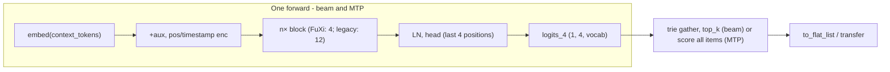

# End-to-end latency flow and optimizations

RecGPT recommendation path from gRPC request through the GPU tensor graph to response. Use with [42_latency_and_performance.md](42_latency_and_performance.md) and the P99/P50 plan (target: **20 ms P50**).

---

## End-to-end flow

```mermaid
flowchart TB
  subgraph ingress [Request ingress]
    gRPC["gRPC PredictRequest"]
    PS["PredictionService.Server"]
    PBC["PredictBatchCollector"]
    gRPC --> PS
    PS --> PBC
  end

  subgraph serve [Serve.recommend]
    State["serve_state: trie_tensors, item_id_to_tokens, get_logits_batch_tensor_fn"]
    PBC --> State
    State --> Decode["Decode.beam_search_top_k_spmd"]
  end

  subgraph cpu_pre [CPU pre-decode]
    CtxList["context_item_ids list"]
    CtxTensor["Nx.tensor + backend_transfer"]
    GatherCtx["Nx.gather item_id_to_tokens → context_tokens"]
    Root["root_state = [0]"]
    CtxList --> CtxTensor
    CtxTensor --> GatherCtx
    GatherCtx --> Root
    Decode --> CtxList
  end

  subgraph one_forward [One forward on GPU]
    S0_In["context_tokens {1, context_len}"]
    S0_JIT["get_logits_4_fn: one full forward"]
    S0_Graph["Embed → +aux → pos → n× block → LN → head"]
    S0_Out["logits_4 (1, 4, vocab_size)"]
    S0_In --> S0_JIT
    S0_JIT --> S0_Graph
    S0_Graph --> S0_Out
    Root --> S0_In
  end

  subgraph steps04 [Beam steps 0–3 - no extra forwards]
    S0_Trie["step 0: slice logits_4[0], trie gather, top_k"]
    S123["steps 1–3: slice logits_4[1..3], trie, top_k (precomputed logits)"]
    S0_Out --> S0_Trie
    S0_Trie --> S123
  end

  subgraph sync [Single CPU sync - bottleneck risk]
    ToList["Nx.to_flat_list item_ids, beam_scores"]
    BTransfer["Nx.backend_transfer prefix_tokens → BinaryBackend"]
    ToList --> BTransfer
    S123 --> ToList
  end

  subgraph cpu_post [CPU post-decode]
    Zip["zip item_ids × scores × prefix_tokens"]
    Fallback["trie map fallback if item_id == -1"]
    Sort["sort by score, take top_k"]
    Response["item_ids → display_name (map lookup)"]
    Zip --> Fallback
    Fallback --> Sort
    Sort --> Response
    BTransfer --> Zip
  end

  subgraph egress [Response egress]
    Resp["PredictResponse: item_ids, items"]
    Response --> Resp
    Resp --> gRPC
  end
```

---

## GPU tensor graph (conceptual)

**FuXi (default):** 4 blocks (Retention + LinearTemporalChannel + LinearPositionalChannel + FFN). **Legacy:** 12× transformer block + WPE when using a non-FuXi checkpoint. Block count and layout depend on checkpoint; see [85 FuXi-Linear status](85_fuxi_linear_status.md).

---

## Where time goes and how to optimize

| Stage               | What happens                                                                                                                                                                                         | Latency                       | Optimizations                                                                                                                                                                              |
| ------------------- | ---------------------------------------------------------------------------------------------------------------------------------------------------------------------------------------------------- | ----------------------------- | ------------------------------------------------------------------------------------------------------------------------------------------------------------------------------------------ |
| **Request ingress** | gRPC decode, validation, batch collector                                                                                                                                                             | Usually &lt;1 ms              | Keep validation cheap; batching is throughput-only.                                                                                                                                        |
| **CPU pre-decode**  | List → tensor, `backend_transfer`, `gather` for context tokens                                                                                                                                       | Small                         | Do once; ensure `item_id_to_tokens` and trie tensors stay on device so no extra transfers.                                                                                                 |
| **One forward (GPU)** | One **full** forward: embed → +aux → pos/timestamps → n blocks (FuXi: 4; legacy: 12) → head over last 4 positions → logits_4 (1, 4, vocab). Then beam steps 0–3 slice that tensor and do trie gather, top_k (no extra model forwards). | **Dominant** (one full seq) | **BF16** (1.3–2×). Single JIT; one graph launch per recommend for beam. |
| **Sync**            | `Nx.to_flat_list(item_ids)`, `to_flat_list(beam_scores)`, `backend_transfer(prefix_tokens)` + `to_flat_list`.                                                                                        | **Blocks GPU** until done     | **Single sync** (already). Transfer only what’s needed (item_ids + scores for top_k; prefix_tokens only if fallback needed). Consider async transfer of prefix_tokens if fallback is rare. |
| **CPU post-decode** | Zip, optional trie fallback (map lookup), sort, top_k, item_id → display_name.                                                                                                                       | Small                         | Keep trie fallback O(1) map; response build = map lookups only.                                                                                                                            |
| **Egress**          | Build protos, gRPC encode.                                                                                                                                                                           | Small                         | —                                                                                                                                                                                          |

---

## Why is the first / single run so slow?

When you run `mix recgpt.trace_predict --runs 1`, you can see **~2–3 s** total instead of the documented warm **~150–200 ms** (beam) or **~50–80 ms** (MTP) for the whole recommend. Main reasons:

1. **Fresh process every time** — `mix recgpt.trace_predict` starts a new Elixir/EXLA process.

---

## Optimizations to reach 20 ms P50

**Implemented (hot path):** Config and constants are read once at load: `beam_width_override` and decode constants (`root_state`, `neg_inf`, `vocab_t`) live in Serve state and are passed to Decode via opts, so no `Application.get_env` or repeated tensor create+transfer per request. Aux/mask are cached by `{batch_size, seq_len}` in the get_logits closure (up to 8 shapes); repeat same-context-length requests skip build+transfer. KV cache padding uses a zero scalar on the target backend before broadcast so padding stays on device.

**One forward, then beam steps:** Beam search does **one** model forward (`get_logits_4_fn` / `forward_last_4_logits`) that returns logits for the last 4 positions (1, 4, vocab_size). Steps 0–3 then slice that tensor and run trie gather + top_k on device—no additional model forwards. So there is **one** graph launch per recommend for beam.

**Multi-Token Prediction (MTP):** The model predicts K tokens at once (e.g. 4 for one item); acceleration is embedded in the model weights during training, so no auxiliary draft model or N-gram cache is needed. One forward produces logits for the full 4-token window; we score all catalog items and take top-k. Can significantly reduce inference cost (e.g. ~3×) vs sequential decoding. Set `RECGPT_DECODE_STRATEGY=mtp` (or `lookahead` / `direct_score`). Best when catalog is small/medium; beam can give better diversity at scale. `mix recgpt.trace_predict` reports `mtp_decode` or `beam_search_total`.

**MTP theory alignment (4-token semantic IDs):**

| Theory | Implementation | Status |
|--------|----------------|--------|
| Single-pass: predict t₀…t₃ in one forward | `forward_last_4_logits` → (1, 4, vocab_size) | ✅ |
| Top-K via product/constrained search over valid paths | score(item) = Σ_p logits[p][token_p]; top-k over catalog | ✅ (product in log space) |
| No recursive beam; parallel path-classifier | One forward + batch score over items; no trie walk | ✅ |
| 4 heads (root, sub, leaf×2) or shared | One shared LM head applied at last 4 positions | ⚠️ Shared-weight (not 4 independent MTP heads) |
| MTP loss: penalize all 4 tokens in same step | `Training.loss_mtp_last_4` + `loss_shifted_ce`; default `mtp_loss_weight: 1.0` | ✅ |

**Training:** Pretrain uses combined loss `loss_shifted_ce + mtp_loss_weight * loss_mtp_last_4` so the model is penalized for errors across all 4 tokens of the next item in the same step. Use `--mtp-loss-weight 0` for shifted CE only.

**MTP zero-shot and trie:** To keep zero-shot integrity (only recommend catalog items), MTP should score only valid candidates and avoid a sequential step 1–3 bottleneck. Our implementation does this by **not** generating free-form token sequences: we take the **catalog as the candidate set** and run a **vectorized score** on GPU (one forward → logits_4; for each item, score = sum of logits at its 4-token ID; then top_k). Every candidate is already a valid 4-token path (the catalog). So we do not need a separate "vectorized trie matcher" to filter—candidates are the catalog, latency is linear in catalog size, and there are no sequential decode steps. The MTP path never uses the trie; the beam path uses the trie for stepwise validity.

**Still to do / config:**

1. **BF16** — Default. Largest single gain (1.3–2×) on the one forward per recommend.
2. **Minimize host round-trips** — Single sync only; no extra `backend_transfer` or `to_flat_list` in the loop. All index tensors for `gather_2d` already on same backend as the tensor they index.
3. **Aux/mask construction** — Cached by `{batch_size, seq_len}` in the get_logits closure (up to 8 shapes); repeat same-context-length requests skip aux/mask build and transfer.
4. **Cache replicate/pad** — `maybe_replicate_cache` and `pad_cache_to_fixed` run when cache is not nil; ensure they don’t add unnecessary transfers; pad once to `max_cache_len` and keep on device.
5. **Trie gather** — Steps do `Nx.gather(next_state, row_indices)` and `gather_2d` with multiple `backend_transfer` for indices; already aligned; if profiling shows gather cost, consider batching or a single fused index op (advanced).
6. **Beam width** — `max(4, min(top_k + 2, 20))` for expected top_k 1–20; only reduce cap if profiling shows beam as dominant and quality allows.
7. **EXLA JIT** — No disk cache; in-process JIT only (cache code removed).
8. **Response build** — Keep display_name as a map lookup by item_id; no per-item heavy work.

---

## See also

- [42 Latency and performance](42_latency_and_performance.md) — Industry context, what we fixed, summary table.
- [66 Nsight Systems tracing](66_nsys_tracing.md) — How to profile with Nsight Systems and NVTX markers.
- [85 FuXi-Linear status](85_fuxi_linear_status.md) — Default is FuXi (4 blocks); graph above is conceptual (block count and layout depend on checkpoint).
- Plan: P99 latency target with buffer (RecGPT target P50 = 20 ms, P99 ≤ 60 ms).
