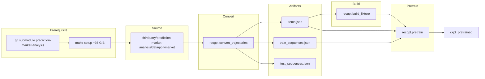

# Pretraining Plan (Phase 1)

Phase 1 pretraining plan: Jon-Becker Polymarket subset only. Prove signal at FuXi metrics (loss). Not production ready.

## Implementation checklist

Use this checklist to run Phase 1 pretraining.

### Prerequisites

- [ ] FuXi checkpoint present at `data/fuxi_ckpt_export` (`mix recgpt.export_fuxi_ckpt --out data/fuxi_ckpt_export` or `mix recgpt.refetch`)
- [ ] Jon-Becker submodule initialized: `git submodule update --init thirdparty/prediction-market-analysis`
- [ ] Jon-Becker data fetched: `cd thirdparty/prediction-market-analysis && make setup` (~36 GiB)

### Pipeline

- [ ] Run migrations: `mix ecto.migrate`
- [ ] Convert with sync: `RECGPT_SQLITE_PATH=priv/recgpt.sqlite3 mix recgpt.convert_trajectories --from thirdparty/prediction-market-analysis --out data/polymarket --format jon_becker --sync-to-db`
- [ ] Build fixture from DB: `mix recgpt.build_fixture --items db --out data/polymarket/fixture.json --ckpt data/fuxi_ckpt_export`
- [ ] Pretrain from DB: `mix recgpt.pretrain --ckpt data/fuxi_ckpt_export --fixture data/polymarket/fixture.json --train db --items db --out data/polymarket/ckpt_pretrained --epochs 5 --eval-test-every 50 --test data/polymarket/test_sequences.json`

---

## Phase 1 Pretraining (Not Production Ready)

| Phase | Standard term | Alternative |
| ----- | ------------- | ----------- |
| 1     | **Phase 1**   | rope bridge |

**Scope:** Minimal. One data source, one flow. Prove the route. **Not production ready.**

- **One resource:** Jon-Becker Polymarket subset only
- **One relation:** convert → build_fixture → pretrain
- **Tuple-based:** DB-backed (items, sequences in SQLite)
- **Goal:** Prove there is signal at the metrics FuXi uses (loss: train_loss down, test_loss down)

---

## Scope

The pretraining pipeline is **already implemented** ([PretrainRunner](../lib/recgpt/pretrain_runner.ex), [recgpt.pretrain](../mix/tasks/recgpt.pretrain.ex), [AxonTrain](../lib/recgpt/axon_train.ex)). This doc is the Phase 1 reference: Jon-Becker Polymarket → prove loss signal.

---

## Data Flow



**Note:** `refetch` does not fetch Jon-Becker. Steam, FuXi ckpt, VAE come from refetch. Jon-Becker Parquet is separate (~36 GiB).

---

## Prerequisites

**Jon-Becker data is NOT in `mix recgpt.refetch`.** Refetch gets FuXi checkpoint, VAE, Steam — not Polymarket. Jon-Becker requires a separate step:

| Requirement            | Source                                                                                                                                                                                                           |
| ---------------------- | ---------------------------------------------------------------------------------------------------------------------------------------------------------------------------------------------------------------- |
| **Jon-Becker Parquet** | `git submodule update --init thirdparty/prediction-market-analysis` then `cd thirdparty/prediction-market-analysis && make setup` (~36 GiB). Creates `data/polymarket/{markets,trades,blocks}/` under that repo. |
| **FuXi checkpoint**    | `mix recgpt.export_fuxi_ckpt --out data/fuxi_ckpt_export` (or `mix recgpt.refetch`)                                                                                                                              |
| **DB**                 | `RECGPT_SQLITE_PATH=priv/recgpt.sqlite3` (default), `mix ecto.migrate`. Required for Phase 1.                                                                                                                        |

---

## Canonical Pipeline Commands (Phase 1)

DB-backed (RECGPT_SQLITE_PATH + ecto.migrate):

```bash
# 0. Get Jon-Becker data first (~36 GiB)
git submodule update --init thirdparty/prediction-market-analysis
cd thirdparty/prediction-market-analysis && make setup

# 1. Convert with sync to SQLite (writes items.json, test_sequences.json; sequences go to DB)
RECGPT_SQLITE_PATH=priv/recgpt.sqlite3 mix recgpt.convert_trajectories \
  --from thirdparty/prediction-market-analysis --out data/polymarket --format jon_becker --sync-to-db

# 2. Build fixture from DB
mix recgpt.build_fixture --items db --out data/polymarket/fixture.json --ckpt data/fuxi_ckpt_export

# 3. Pretrain from DB
mix recgpt.pretrain --ckpt data/fuxi_ckpt_export --fixture data/polymarket/fixture.json \
  --train db --items db --out data/polymarket/ckpt_pretrained --epochs 5 \
  --eval-test-every 50 --test data/polymarket/test_sequences.json
```

**Convert `--from`:** Must be `thirdparty/prediction-market-analysis` (project root). Converter finds `data/polymarket` under it. See [thirdparty/README.md](../thirdparty/README.md), [78 Bulk data not in git](78_bulk_data_not_in_git.md).

---

## Pretrain Options Summary

| Option              | Default                                   | Purpose                                              |
| ------------------- | ----------------------------------------- | ---------------------------------------------------- |
| `--ckpt`            | `data/fuxi_ckpt_export`                   | Checkpoint dir (FuXi)                                |
| `--fixture`         | `data/steam/fixture.json`                 | Fixture path (Phase 1: data/polymarket/fixture.json) |
| `--train`           | `data/steam/train_sequences.json` or `db` | Train sequences (Phase 1: db)                        |
| `--items`           | `data/steam/items.json` or `db`           | Items (Phase 1: db)                                  |
| `--out`             | (required)                                | Output checkpoint dir                                |
| `--iterations`      | 100                                       | Max steps (ignored if `--epochs` set)                |
| `--epochs`          | nil                                       | Full passes (overrides iterations)                   |
| `--save-every`      | 0                                         | Save step checkpoint every N                         |
| `--eval-test-every` | 0                                         | Test loss every N (requires `--test`)                 |
| `--test`            | nil                                       | Path to test_sequences.json                           |
| `--batch-size`      | 8                                         | Batch size                                           |
| `--learning-rate`   | 1.0e-4                                    | LR                                                   |
| `--limit`           | fixture num_items                         | Max items to encode                                  |

---

## Data Source: Jon-Becker Polymarket

| Source         | Location                                                                    | Converter                                                          | Timestamps                                               |
| -------------- | --------------------------------------------------------------------------- | ------------------------------------------------------------------ | -------------------------------------------------------- |
| **Jon-Becker** | `thirdparty/prediction-market-analysis/data/polymarket/` after `make setup` | `--from thirdparty/prediction-market-analysis --format jon_becker` | Yes (FuXi; [91 FuXi real timestamps](91_fuxi_linear_real_timestamps.md)) |

Not in git; not in refetch. See [78 Bulk data not in git](78_bulk_data_not_in_git.md).

---

## Train–Test Loss Loop

When `--eval-test-every N --test <path>` is set, every N steps prints:

```
Step 50 train_loss=1.234 test_loss=1.456 best_test=1.456
```

Use `best_test` to detect overfitting. Combine with `--save-every` to keep checkpoints and select by test loss.

---

## Phase 1 Out of Scope

Warm-items fixture, resume from checkpoint, LR schedule, other data sources (MovieLens, KuaiRand, Steam) — not in Phase 1.

---

## See also

- [03 Pipeline steps](03_pipeline_steps.md) — Build fixture; Pretrain; Eval
- [53 Mix tasks](53_mix_tasks.md) — convert_trajectories, build_fixture, pretrain
- [78 Bulk data not in git](78_bulk_data_not_in_git.md) — Jon-Becker ~36 GiB
- [90 Train–test loss loop](90_train_test_loss_loop.md) — eval-test-every details
- [91 FuXi real timestamps](91_fuxi_linear_real_timestamps.md) — Timestamps for FuXi
