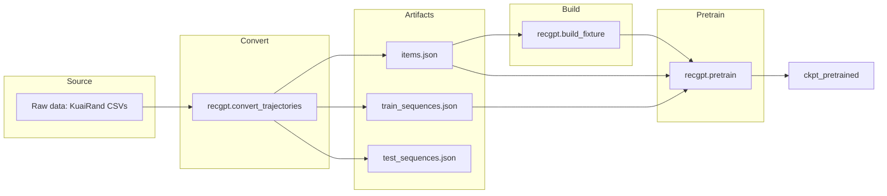

# Pretraining Plan (Phase 1)

Phase 1 pretraining: one data source, one flow. Prove signal at FuXi metrics (loss). Not production ready. **KuaiRand-Pure** (file-based).

## Implementation checklist

Use this checklist to run Phase 1 pretraining.

### Prerequisites

- [ ] FuXi checkpoint at `data/fuxi_ckpt_export` (`mix recgpt.export_fuxi_ckpt --out data/fuxi_ckpt_export` or `mix recgpt.refetch`)
- [ ] KuaiRand-Pure folder (e.g. `thirdparty/KuaiRand-Pure` or `C:\...\KuaiRand-Pure`)

### Pipeline

- [ ] Convert: `mix recgpt.convert_trajectories --from /path/to/KuaiRand-Pure --out data/kuairand --format kuairand`
- [ ] Build fixture: `mix recgpt.build_fixture --items data/kuairand/items.json --out data/kuairand/fixture.json --ckpt data/fuxi_ckpt_export`
- [ ] Pretrain: `mix recgpt.pretrain --ckpt data/fuxi_ckpt_export --fixture data/kuairand/fixture.json --train data/kuairand/train_sequences.json --items data/kuairand/items.json --out data/kuairand/ckpt_pretrained --epochs 5 --eval-test-every 50 --test data/kuairand/test_sequences.json`

---

## Phase 1 Pretraining (Not Production Ready)

| Phase | Standard term | Alternative |
| ----- | ------------- | ----------- |
| 1     | **Phase 1**   | rope bridge |

**Scope:** Minimal. One data source, one flow. Prove the route. **Not production ready.**

- **One resource:** KuaiRand-Pure
- **One relation:** convert → build_fixture → pretrain
- **Tuple-based:** File-based (items and sequences as JSON)
- **Goal:** Prove there is signal at the metrics FuXi uses (loss: train_loss down, test_loss down)

---

## Scope

The pretraining pipeline is **already implemented** ([PretrainRunner](../lib/recgpt/pretrain_runner.ex), [recgpt.pretrain](../mix/tasks/recgpt.pretrain.ex), [AxonTrain](../lib/recgpt/axon_train.ex)). This doc is the Phase 1 reference: KuaiRand-Pure → prove loss signal.

---

## Data Flow



**Note:** `refetch` gets FuXi, VAE, Steam — not KuaiRand. KuaiRand is a separate dataset.

---

## Prerequisites

| Requirement         | Source                                                                 |
| ------------------- | --------------------------------------------------------------------- |
| **FuXi checkpoint** | `mix recgpt.export_fuxi_ckpt --out data/fuxi_ckpt_export` or refetch   |
| **KuaiRand-Pure**   | Any folder with `log_standard_*.csv`, `log_random_*.csv`; optional `video_features_basic_pure.csv` |

---

## Canonical Pipeline Commands (Phase 1)

Point `--from` at the folder with `log_standard_*.csv`, `log_random_*.csv`, and optionally `video_features_basic_pure.csv`. No DB required.

**Windows example:**

```bash
mix recgpt.convert_trajectories --from "C:\Users\ernest.lee\Desktop\KuaiRand-Pure" --out data/kuairand --format kuairand

mix recgpt.build_fixture --items data/kuairand/items.json --out data/kuairand/fixture.json --ckpt data/fuxi_ckpt_export

mix recgpt.pretrain --ckpt data/fuxi_ckpt_export --fixture data/kuairand/fixture.json \
  --train data/kuairand/train_sequences.json --items data/kuairand/items.json \
  --out data/kuairand/ckpt_pretrained --epochs 5 \
  --eval-test-every 50 --test data/kuairand/test_sequences.json
```

**Linux/WSL:** e.g. `--from thirdparty/KuaiRand-Pure` or `/path/to/KuaiRand-Pure`.

---

## Pretrain Options Summary

| Option              | Default                                   | Purpose                                              |
| ------------------- | ----------------------------------------- | ---------------------------------------------------- |
| `--ckpt`            | `data/fuxi_ckpt_export`                   | Checkpoint dir (FuXi)                                |
| `--fixture`         | `data/steam/fixture.json`                 | Fixture path                                          |
| `--train`           | `data/steam/train_sequences.json` or `db` | Train sequences (file or db)                          |
| `--items`           | `data/steam/items.json` or `db`           | Items (file or db)                                   |
| `--out`             | (required)                                | Output checkpoint dir                                |
| `--iterations`      | 100                                       | Max steps (ignored if `--epochs` set)                |
| `--epochs`          | nil                                       | Full passes (overrides iterations)                   |
| `--save-every`      | 0                                         | Save step checkpoint every N                         |
| `--eval-test-every` | 0                                         | Test loss every N (requires `--test`)                 |
| `--test`            | nil                                       | Path to test_sequences.json                           |
| `--batch-size`      | 8                                         | Batch size                                           |
| `--learning-rate`   | 1.0e-4                                    | LR                                                   |
| `--limit`           | fixture num_items                         | Max items to encode                                  |

---

## Train–Test Loss Loop

When `--eval-test-every N --test <path>` is set, every N steps prints:

```
Step 50 train_loss=1.234 test_loss=1.456 best_test=1.456
```

Use `best_test` to detect overfitting. Combine with `--save-every` to keep checkpoints and select by test loss.

---

## Phase 1 Out of Scope

Warm-items fixture, resume from checkpoint, LR schedule, other data sources (MovieLens, Steam) — not in Phase 1.

---

## See also

- [03 Pipeline steps](03_pipeline_steps.md) — Build fixture; Pretrain; Eval
- [53 Mix tasks](53_mix_tasks.md) — convert_trajectories, build_fixture, pretrain
- [78 Bulk data not in git](78_bulk_data_not_in_git.md) — Bulk data inventory
- [90 Train–test loss loop](90_train_test_loss_loop.md) — eval-test-every details
- [91 FuXi real timestamps](91_fuxi_linear_real_timestamps.md) — Timestamps for FuXi
