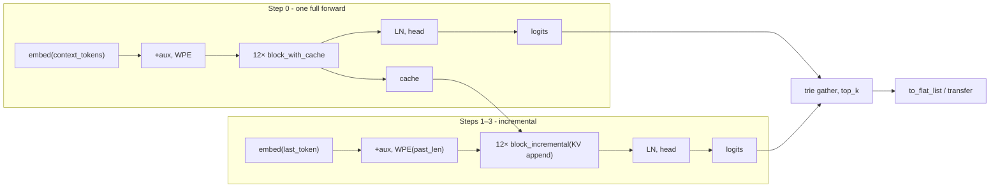

# End-to-end latency flow and optimizations

RecGPT recommendation path from gRPC request through the GPU tensor graph to response. Use with [08_latency_and_performance.md](08_latency_and_performance.md) and the P99/P50 plan (target: **20 ms P50**).

---

## End-to-end flow

```mermaid
flowchart TB
  subgraph ingress [Request ingress]
    gRPC["gRPC PredictRequest"]
    PS["PredictionService.Server"]
    PBC["PredictBatchCollector"]
    gRPC --> PS
    PS --> PBC
  end

  subgraph serve [Serve.recommend]
    State["serve_state: trie_tensors, item_id_to_tokens, get_logits_batch_tensor_fn"]
    PBC --> State
    State --> Decode["Decode.beam_search_top_k_spmd"]
  end

  subgraph cpu_pre [CPU pre-decode]
    CtxList["context_item_ids list"]
    CtxTensor["Nx.tensor + backend_transfer"]
    GatherCtx["Nx.gather item_id_to_tokens → context_tokens"]
    Root["root_state = [0]"]
    CtxList --> CtxTensor
    CtxTensor --> GatherCtx
    GatherCtx --> Root
    Decode --> CtxList
  end

  subgraph step0 [Step 0 - Full forward on GPU]
    S0_In["context_tokens {1, context_len}"]
    S0_JIT["jit_full: forward_with_cache"]
    S0_Graph["Embed → +aux → WPE → 12× block_with_cache → LN → head"]
    S0_Out["logits, cache"]
    S0_Trie["gather next_state(root_state, top_tokens)"]
    S0_TopK["top_k, valid_mask, select, new_state_ids"]
    S0_In --> S0_JIT
    S0_JIT --> S0_Graph
    S0_Graph --> S0_Out
    S0_Out --> S0_TopK
    S0_TopK --> S0_Trie
    Root --> S0_In
  end

  subgraph steps123 [Steps 1–3 - Incremental forward on GPU]
    S1_Concat["context_broadcast ⊕ prefix_slice → batch"]
    S1_JIT["jit_incr: forward_incremental"]
    S1_Graph["Embed last_token → +aux → WPE(pos) → 12× block_incremental → LN → head"]
    S1_Out["logits, new_cache"]
    S1_Trie["gather next_state / item_at_leaf"]
    S1_TopK["top_k flat, batch_indices, token_ids, state_at_top"]
    S1_Concat --> S1_JIT
    S1_JIT --> S1_Graph
    S1_Graph --> S1_Out
    S1_Out --> S1_TopK
    S1_TopK --> S1_Trie
    S0_Trie --> S1_Concat
    S1_Trie --> S1_Concat
  end

  subgraph sync [Single CPU sync - bottleneck risk]
    ToList["Nx.to_flat_list item_ids, beam_scores"]
    BTransfer["Nx.backend_transfer prefix_tokens → BinaryBackend"]
    ToList --> BTransfer
    S1_Trie --> ToList
  end

  subgraph cpu_post [CPU post-decode]
    Zip["zip item_ids × scores × prefix_tokens"]
    Fallback["trie map fallback if item_id == -1"]
    Sort["sort by score, take top_k"]
    Response["item_ids → display_name (map lookup)"]
    Zip --> Fallback
    Fallback --> Sort
    Sort --> Response
    BTransfer --> Zip
  end

  subgraph egress [Response egress]
    Resp["PredictResponse: item_ids, items"]
    Response --> Resp
    Resp --> gRPC
  end
```

---

## GPU tensor graph (conceptual)

---

## Where time goes and how to optimize

| Stage | What happens | Latency | Optimizations |
|-------|------------------------|--------|----------------------------------------------------------------|
| **Request ingress** | gRPC decode, validation, batch collector | Usually &lt;1 ms | Keep validation cheap; batching is throughput-only. |
| **CPU pre-decode** | List → tensor, `backend_transfer`, `gather` for context tokens | Small | Do once; ensure `item_id_to_tokens` and trie tensors stay on device so no extra transfers. |
| **Step 0 (GPU)** | One **full** forward: embed → 12 layers (with cache fill) → head. Then trie gather, top_k, mask, select. | **Dominant** (one full seq) | **BF16** (1.3–2×). Single JIT for full forward; EXLA cache key stable (padded cache). |
| **Steps 1–3 (GPU)** | Three **incremental** forwards: concat context+prefix → embed last token only → 12 incremental layers (KV append) → head. Then trie gather, top_k, flatten, quotient/remainder, gather state_at_top. | **Dominant** (3× incremental) | **BF16**. Keep `context_broadcast` and concat on device. Consider fused step loop in Defn if EXLA can fuse (experimental). |
| **Sync** | `Nx.to_flat_list(item_ids)`, `to_flat_list(beam_scores)`, `backend_transfer(prefix_tokens)` + `to_flat_list`. | **Blocks GPU** until done | **Single sync** (already). Transfer only what’s needed (item_ids + scores for top_k; prefix_tokens only if fallback needed). Consider async transfer of prefix_tokens if fallback is rare. |
| **CPU post-decode** | Zip, optional trie fallback (map lookup), sort, top_k, item_id → display_name. | Small | Keep trie fallback O(1) map; response build = map lookups only. |
| **Egress** | Build protos, gRPC encode. | Small | — |

---

## Why is the first / single run so slow?

When you run `mix recgpt.trace_predict --runs 1`, you can see **~2–3 s** total (e.g. ~600 ms per forward × 4) instead of the documented warm **~300–400 ms** for the whole recommend. Main reasons:

1. **Fresh process every time** — `mix recgpt.trace_predict` starts a new Elixir/EXLA process. There is no long-lived in-memory JIT state. The “setup” run compiles and runs once; the *timed* run is still the first “real” use of those compilations in this process, and can pay one-time costs (see below). For warm 200–400 ms, use a long-lived server: `mix recgpt.serve` and call the gRPC Predict API repeatedly.

2. **EXLA cache shape mismatch** — The JIT disk cache is keyed by (exla, nx, ckpt, dtype, max_cache_len), not by input shapes. If the cached binary was built for different batch/sequence shapes (e.g. from another beam_width or context length), EXLA reports “disk cache does not match configuration” and **recompiles** for the current shapes. So the first recommend in this process may trigger 4 compilations (one full forward + three incremental with different `past_len`). Compilation dominates the first run.

3. **First execution after compile** — The first time each compiled graph actually runs, the GPU may do lazy allocation, cuDNN workspace setup, and other one-off work. So even after “setup”, the first timed run can be slower than run 2, 3, … Use `--runs 5` or more to see warm timings (run 1 = cold, runs 2+ = warm).

4. **Small batch sizes** — Step 0 uses batch size **1** (one context sequence); steps 1–3 use batch size **beam_width** (4–20 for top_k 1–20). Small batches underutilize the GPU (low occupancy, kernel launch overhead). That can add ~2× vs ideal; BF16 and larger effective batches (e.g. multi-request batching) help.

5. **FP32** — Default inference is FP32. BF16 on Tensor Cores is typically 1.3–2× faster; enable in prod with `config :recgpt, :inference_dtype, {:bf, 16}` after validating quality.

**Takeaway:** For a single `trace_predict` run, expect ~2–3 s (cold). For warm latency, use `--runs 10` or more and look at P50 of runs 2–10, or run the gRPC server and hit it repeatedly.

**Tombstones:**
- **Double warm-up** — Two setup recommends before the timed run in `trace_predict` was tried and reverted; no improvement to the single timed run (~2.7 s).
- **EXLA JIT disk cache** — With cache enabled, the timed run was ~2.6–3.2 s (~600–750 ms/forward). Without disk cache, the same run was **~371 ms** (~65 ms/forward). Caching code removed; in-process JIT only.

---

## Optimizations to reach 20 ms P50

**Implemented (hot path):** Config and constants are read once at load: `beam_width_override` and decode constants (`root_state`, `neg_inf`, `vocab_t`) live in Serve state and are passed to Decode via opts, so no `Application.get_env` or repeated tensor create+transfer per request. Pre-alloc aux/mask on device for full (1×256×192) and incremental (20×1×192); closure slices when shape fits. KV cache padding uses a zero scalar on the target backend before broadcast so padding stays on device.

**Four forwards and inlining:** The beam search does four inference steps: one full forward (step 0) and three incremental (steps 1–3). Each step is a **separate call** from Elixir into the JIT (four graph launches). There is no “inlining” of these four in the current code—they are already **outlined** (four distinct invocations).

- **Removing inlining** — There is nothing to remove; the four forwards are already separate. Splitting further (e.g. more helper calls around each step) would only add call overhead and would **not** perform better.
- **Increasing inlining** — **Fusing** the four forwards into a **single** `Nx.Defn` (one graph that runs step 0 → trie/top_k → step 1 → … → step 3 and returns item_ids) would **reduce kernel launch overhead** and let XLA optimize across steps. That is the “fused Defn for beam search” idea: one launch instead of four, often **~10–25%** gain. **Implemented:** `InferenceDefn.beam_search_fused/14` runs step 0 + steps 1–3 in one JIT graph. Fused is **on for all paths** when no context-cache hit: one JIT compiled at max beam width (`config :recgpt, :fused_beam_width`, default 20); Decode slices the fused result to the request’s beam_width before sync (masks out the rest). **Estimated e2e gain:** ~10–25% of beam-search GPU time → **~15–50 ms** end-to-end if four forwards are ~150–200 ms of a 300 ms recommend (e.g. 300 ms → ~250–285 ms).

**Still to do / config:**
1. **BF16** — Set `config :recgpt, :inference_dtype, {:bf, 16}`. Largest single gain (1.3–2×) on the four forward passes.
2. **Minimize host round-trips** — Single sync only; no extra `backend_transfer` or `to_flat_list` in the loop. All index tensors for `gather_2d` already on same backend as the tensor they index.
3. **Aux/mask construction** — In `build_get_logits_batch_tensor_fn`, aux and mask are built every call; if shapes are fixed, consider reusing or caching on device (minor).
4. **Cache replicate/pad** — `maybe_replicate_cache` and `pad_cache_to_fixed` run when cache is not nil; ensure they don’t add unnecessary transfers; pad once to `max_cache_len` and keep on device.
5. **Trie gather** — Steps do `Nx.gather(next_state, row_indices)` and `gather_2d` with multiple `backend_transfer` for indices; already aligned; if profiling shows gather cost, consider batching or a single fused index op (advanced).
6. **Beam width** — `max(4, min(top_k + 2, 20))` for expected top_k 1–20; only reduce cap if profiling shows beam as dominant and quality allows.
7. **EXLA JIT** — No disk cache; in-process JIT only (cache code removed).
8. **Response build** — Keep display_name as a map lookup by item_id; no per-item heavy work.

---

## See also

- [08_latency_and_performance.md](08_latency_and_performance.md) — Industry context, what we fixed, summary table.
- [nsys_tracing.md](nsys_tracing.md) — How to profile with Nsight Systems and NVTX markers.
- [ablation_tensor_graph.md](ablation_tensor_graph.md) — What can be removed or simplified without breaking semantic id or top-k (ablation testing).
- Plan: P99 latency target with buffer (RecGPT target P50 = 20 ms, P99 ≤ 60 ms).
